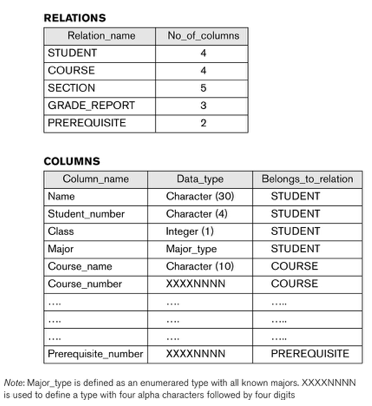

# CSCI 360 Spring 2021

# Chapter 0: Introduction to Databases

# 0. SQL vs. NO-SQL

[SQL vs NoSQL: What's the difference?](https://www.guru99.com/sql-vs-nosql.html)

[Introduction to NoSQL](https://www.geeksforgeeks.org/introduction-to-nosql/)

## What is SQL?
+ Structured Query language (SQL) pronounced as "S-Q-L" or sometimes as "See-Quel" is the standard language for dealing with Relational Databases. A relational database defines relationships in the form of tables.
+ Relational databases like MySQL Database, Oracle, Ms SQL Server, Sybase, etc. use SQL

## What is NoSQL?
+ NoSQL database stands for "Not Only SQL" or "Not SQL."
+ NoSQL is a non-relational DMS, that does not require a fixed schema, avoids joins, and is easy to scale. NoSQL database is used for distributed data stores with humongous data storage needs. NoSQL is used for Big data and real-time web apps. For example companies like Twitter, Facebook, Google that collect terabytes of user data every single day.
+ A NoSQL database system encompasses a wide range of database technologies that can store structured, semi-structured, unstructured and polymorphic data.
+ Redis, MongoDB, CouchDB, Cloudant

# 1. Databases and Database Users(chapter 1, Fundamentals of Database Systems (7th Edition))

## 1.1 Types of Databases and Database Applications
+ Traditional Applications:
  - Numeric and Textual Databases
+ More Recent Applications:
  - Multimedia Databases
  - Geographic Information Systems (GIS)
  - Biological and Genome Databases
  - Data Warehouses
  - Mobile databases
  - Real-time and Active Databases
+ A number of recent applications are described later in the book (for example, Chapters 24,25,26,27,28,29)

### Recent Developments
+ Social Networks started capturing a lot of information about people and about communications among people-posts, tweets, photos, videos in systems such as:
  - Facebook
  - Twitter
  - Linked-In
+ All of the above constitutes data
+ Search Engines- Google, Bing, Yahoo : collect their own repository of web pages for searching purposes
+ New Technologies are emerging from the so-called non-database software vendors to manage vast amounts of data generated on the web:

+ Big Data storage systems involving large clusters of distributed computers (Chapter 25)
+ NOSQL (Not Only SQL) systems (Chapter 24)
+ A large amount of data now resides on the “cloud” which means it is in huge data centers using thousands of machines.
### Impact of Databases and Database Technology
+ Businesses: Banking, Insurance, Retail, Transportation, Healthcare, Manufacturing
+ Service Industries: Financial, Real-estate, Legal, Electronic Commerce, Small businesses
+ Education : Resources for content and Delivery
+ More recently: Social Networks, Environmental and Scientific Applications, Medicine and Genetics
+ Personalized Applications: based on smart mobile devices
## 1.2 Basic Definitions
+ **Database**:
  - A collection of related data.
+ **Data**:
  - Known facts that can be recorded and have an implicit meaning.
+ **Mini-world**:
  - Some part of the real world about which data is stored in a database. For example, student grades and transcripts at a university.
+ **Database Management System (DBMS)**:
  - A software package/ system to facilitate the creation and maintenance of a computerized database.
+ **Database System**:
  - The DBMS software together with the data itself.  Sometimes, the applications are also included.
  

### Simplified database system environment

## 1.3 Typical DBMS Functionality
+ Define a particular database in terms of its data types, structures, and constraints
+ Construct or Load the initial database contents on a secondary storage medium
+ Manipulating the database:
  - Retrieval: Querying, generating reports
  - Modification: Insertions, deletions and updates to its content
  - Accessing the database through Web applications
+ Processing and Sharing by a set of concurrent users and application programs – yet, keeping all data valid and consistent

### Additional DBMS Functionality
DBMS may additionally provide:
+ Protection or Security measures to prevent unauthorized access
+ “Active” processing to take internal actions on data
+ Presentation and Visualization of data
+ Maintenance of the database and associated programs over the lifetime of the database application
  - Called database, software, and system maintenance

### Application Activities Against a Database
+ Applications interact with a database by generating
  - Queries: that access different parts of data and formulate the result of a request
  - Transactions: that may read some data and “update” certain values or generate new data and store that in the database
+ Applications must not allow unauthorized users to access data
+ Applications must keep up with changing user requirements against the database

## 1.4 Example of a Database (UNIVERSITY)
### Example of a Database (with a Conceptual Data Model)
+ Mini-world for the example:
  - Part of a UNIVERSITY environment.
+ Some mini-world entities:
  - STUDENTs
  - COURSEs
  - SECTIONs (of COURSEs)
  - (academic) DEPARTMENTs
  - INSTRUCTORs
+ Some mini-world relationships:
  - SECTIONs are of specific COURSEs
  - STUDENTs take SECTIONs
  - COURSEs have  prerequisite COURSEs
  - INSTRUCTORs teach  SECTIONs
  - COURSEs are offered by  DEPARTMENTs
  - STUDENTs major in  DEPARTMENTs

+ Note: The above entities and relationships are typically expressed in a conceptual data model, such as the ENTITY-RELATIONSHIP data model (see Chapters 3, 4)

## 1.5 Main Characteristics of the Database Approach

Example of a simplified database catalog

+ Self-describing nature of a database system:
  - A DBMS **catalog** stores the description of a particular database (e.g. data structures, types, and constraints)
  - The description is called **meta-data**.
  - This allows the DBMS software to work with different database applications.

  - **Note**: Some newer systems such as a few NOSQL systems need no meta-data: they store the data definition within its structure making it self describing

+ Insulation between programs and data:
  - Called **program-data independence**.
  - Allows changing data structures and storage organization without having to change the DBMS access programs.

+ Data Abstraction: 
  - A **data model** is used to hide storage details and present the users with a conceptual view  of the database.
  - Programs refer to the data model constructs rather than data storage details
+ Support of multiple views of the data:
  - Each user may see a different view of the database, which describes only the data of interest to that user.
+ Sharing of data and multi-user transaction processing:
  - Allowing a set of concurrent users to retrieve from and to update the database.
  - Concurrency control within the DBMS guarantees that each transaction is correctly executed or aborted
  - Recovery subsystem ensures each completed transaction has its effect permanently recorded in the database
  - OLTP (Online Transaction Processing) is a major part of database applications. This allows hundreds of concurrent transactions to execute per second.
## 1.6 Types of Database Users
+ Users may be divided into
  - Those who actually use and control the database content, and those who design, develop and maintain database applications (called “Actors on the Scene”), and
  - Those who design and develop the DBMS software and related tools, and the computer systems operators (called “Workers Behind the Scene”).
### Database Users – Actors on the Scene 
+ Actors on the scene: who design, use, and administer a database.
  - **Database administrators**:
    + Responsible for authorizing access to the database, for coordinating and monitoring its use, acquiring software and hardware resources, controlling its use and monitoring efficiency of operations.
  - **Database Designers**:
    + Responsible to define the content, the structure, the constraints, and functions or transactions against the database. They must communicate with the end-users and understand their needs.
  - **Database End Users**:
    + They use the data for queries, reports and some of them update the database content. End-users can be categorized into:
      - Casual: access database occasionally when needed
      - Naïve or Parametric: they make up a large section of the end-user population.
        + They use previously well-defined functions in the form of  “canned transactions” against the database.
        + Users of Mobile Apps mostly fall in this category
        + Bank-tellers or reservation clerks are parametric users who do this activity for an entire shift of operations.
        + Social Media Users post and read information from websites
      - Sophisticated:
        + These include business analysts, scientists, engineers, others thoroughly familiar with the system capabilities.
        + Many use tools in the form of software packages that work closely with the stored database.
      - Stand-alone:
        + Mostly maintain personal databases using ready-to-use packaged applications.
        + An example is the user of a tax program that creates its own internal database.
        + Another example is a user that maintains a database of personal photos and videos.
  - **System Analysts and Application Developers** (This category currently accounts for a very large proportion of the IT work force.)
    + **System Analysts**: They understand the user requirements of naïve and sophisticated users and design applications including canned  transactions to meet those requirements. 
    + **Application Programmers**: Implement the specifications developed by analysts and test and debug them before deployment.
    + **Business Analysts**: There is an increasing need for such people who can analyze vast amounts of business data and real-time data (“Big Data”) for better decision making related to planning, advertising, marketing etc. 
### Database Users – Actors behind the Scene 
+ Actors behind the Scene: who design, develop, and operate the DBMS software and system enviroment.
  - **DBMS System Designers and Implementors**: Design and implement DBMS packages in the form of modules and interfaces and test and debug them. The DBMS must interface with applications, language compilers, operating system components, etc.
  - **Tool Developers**: Design and implement software systems called  tools for modeling and designing databases, performance monitoring, prototyping, test data generation, user interface creation, simulation etc. that facilitate building of applications and allow using database effectively.  
  - **Operators and Maintenance Personnel**: They manage the actual running and maintenance of the database system hardware and software environment.

## 1.7 Advantages of Using the Database Approach
+ Controlling redundancy in data storage and in development and maintenance efforts.
  - Sharing of data among multiple users.
+ Restricting unauthorized access to data. Only the DBA staff uses privileged commands and facilities.
+ Providing persistent storage for program Objects
  - E.g., Object-oriented DBMSs make program objects persistent– see Chapter 12.
+ Providing Storage Structures (e.g. indexes) for efficient Query Processing – see Chapter 17.
+ Providing optimization of queries for efficient processing.
+ Providing backup and recovery services.
+ Providing multiple interfaces to different classes of users.
+ Representing complex relationships among data.
+ Enforcing integrity constraints on the database.
+ Drawing inferences and actions from the stored data using deductive and active rules and triggers.

### Additional Implications of Using the Database Approach
+ Potential for enforcing standards:
  - This is very crucial for the success of database applications in large organizations. Standards refer to data item names, display formats, screens, report structures, meta-data (description of data), Web page layouts, etc.
+ Reduced application development time:
  - Incremental time to add each new application is reduced.
+ Flexibility to change data structures:
  - Database structure may evolve as new requirements are defined. 
+ Availability of current information:
  - Extremely important for on-line transaction systems such as shopping, airline, hotel, car reservations.
+ Economies of scale:
  - Wasteful overlap of resources and personnel can be avoided by consolidating data and applications across departments.
## 1.8 Historical Development of Database Technology
+ Early Database Applications:
  - The Hierarchical and Network Models were introduced in mid 1960s and dominated during the seventies.
  - A bulk of the worldwide database processing still occurs using these models, particularly, the hierarchical model using IBM’s IMS system.
+ Relational Model based Systems:
  - Relational model was originally introduced in 1970, was heavily researched and experimented within IBM Research and several universities.
  - Relational DBMS Products emerged in the early 1980s.
+ Object-oriented and emerging applications:
  - Object-Oriented Database Management Systems (OODBMSs) were introduced in late 1980s and early 1990s to cater to the need of complex data processing in CAD and other applications.
    + Their use has not taken off much.
  - Many relational DBMSs have incorporated object database concepts, leading to a new category called object-relational DBMSs (ORDBMSs)
  - Extended relational systems add further capabilities (e.g. for multimedia data, text, XML, and other data types)
+ Data on the Web and E-commerce Applications:
  - Web contains data in HTML (Hypertext markup language) with links among pages.
  - This has given rise to a new set of applications and E-commerce is using new standards like XML (eXtended  Markup Language). (see Ch. 13).
  - Script programming languages such as PHP and JavaScript allow generation of dynamic Web pages that are partially generated from a database (see Ch. 11).
    + Also allow database updates through Web pages
## 1.9 Extending Database Capabilities
+ New functionality is being added to DBMSs in the following areas:
  - Scientific Applications – Physics, Chemistry, Biology - Genetics
  - Earth and Atmospheric Sciences and Astronomy
  - XML (eXtensible Markup Language)
  - Image Storage and Management
  - Audio and Video Data Management
  - Data Warehousing and Data Mining – a very major area for future development using new technologies (see Chapters 28-29)
  - Spatial Data Management and Location Based Services
  - Time Series and Historical Data Management
+ The above gives rise to new research and development in incorporating new data types, complex data structures, new operations and storage and indexing schemes in database systems.
+ Background since the advent of the  21st Century:

  - First decade of the 21st century has seen tremendous growth in user generated data and automatically collected data from applications and search engines.

  - Social Media platforms such as Facebook and Twitter are generating millions of transactions a day and businesses are interested to tap into this data to “understand” the users

  - Cloud Storage and Backup is making unlimited amount of storage available to users and applications
+ Emergence of Big Data Technologies and NOSQL databases
  - New data storage, management and analysis technology was necessary to deal with the onslaught of data in petabytes a day (1015 bytes or 1000 terabytes) in some applications – this started being commonly called as “Big Data”.
  - Hadoop (which originated from Yahoo) and Mapreduce Programming approach to distributed data processing (which originated from Google) as well as the Google file system have given rise to Big Data technologies (Chapter 25). Further enhancements are taking place in the form of Spark based technology.
  - NOSQL (Not Only SQL- where SQL is the de facto standard language for relational DBMSs) systems have been designed for rapid search and retrieval from documents, processing of huge graphs occurring on social networks, and other forms of unstructured data with flexible models of transaction processing (Chapter 24). 
## 1.10 When Not to Use Databases
+ Main inhibitors (costs) of using a DBMS:
  - High initial investment and possible need for additional hardware.
  - Overhead for providing generality, security, concurrency control, recovery, and  integrity functions.
+ When a DBMS may be unnecessary:
  - If the database and applications are simple, well defined, and not expected to change.
  - If access to data by multiple users is not required.
+ When a DBMS may be infeasible:
  - In embedded systems where a general purpose DBMS may not fit in available storage
+ When no DBMS may suffice:
  - If there are stringent real-time requirements that may not be met because of DBMS overhead (e.g., telephone switching systems)
  - If the database system is not able to handle the complexity of data because of modeling limitations (e.g., in complex genome and protein databases)
  - If the database users need special operations not supported by the DBMS (e.g., GIS and location based services).
  
  
 
# 2: Database System Concepts and Architecture (Chapter 2, Fundamentals of Database Systems (7th Edition))

## 2.1 Data Models
+ Data Model:
  - A set of concepts to describe the structure of a database, the operations for manipulating these structures, and certain constraints that the database should obey.
+ Data Model Structure and Constraints:
  - Constructs are used to define the database structure
  - Constructs typically include elements (and their data types) as well as groups of elements (e.g. entity, record, table), and relationships among such groups
  - Constraints specify some restrictions on valid data; these constraints must be enforced at all times
+ Data Model Operations:
  - These operations are used for specifying database retrievals and updates by referring to the constructs of the data model.
  - Operations on the data model may include basic model operations (e.g. generic insert, delete, update) and user-defined operations (e.g. compute_student_gpa, update_inventory)

### 2.1.1 Categories of Data Models
+ Conceptual (high-level, semantic) data models:
  - Provide concepts that are close to the way many users perceive data. (Also called entity-based or object-based data models.)
    + entity (e.g. employee)
    + attribute (e.g. employee's name)
    + relationship (e.g. a work-on relationship between an employee and a project)
+ Physical (low-level, internal) data models:
  - Provide concepts that describe details of how data is stored in the computer. These are usually specified in an ad-hoc manner through DBMS design and administration manuals.
    + record formats
    + record orderings
    + access paths
+ Implementation (representational) data models:
  - Provide concepts that fall between the above two, used by many commercial DBMS implementations (e.g. relational data models used in many commercial systems).
+ Self-Describing Data Models:
  - Combine the description of data with the data values. Examples include XML, key-value stores and some NOSQL systems.

### 2.1.2 Schemas, Instances, and Database State
####  Schemas vs. Instances
+ Database Schema:
  - The description of a database.
  - Includes descriptions of the database structure, data types, and the constraints on the database.
+ Schema Diagram:
  - An illustrative display of (most aspects of) a database schema.
+ Schema Construct:
  - A component of the schema or an object within the schema, e.g., STUDENT, COURSE.
+ Database State:
  - The actual data stored in a database at a particular moment in time. This includes the collection of all the data in the database.
  - Also called database instance (or occurrence or snapshot).
    + The term instance  is also applied to individual database components, e.g. record instance, table instance, entity instance
#### Database Schema vs. Database State
+ Database State: 
  - Refers to the content of a database at a moment in time.
+ Initial Database State:
  - Refers to the database state when it is initially loaded into the system.
+ Valid State:
  - A state that satisfies the structure and constraints of the database.
+ Distinction
  - The database schema changes very infrequently. 
  - The database state changes every time the database is updated. 
+ Meta-data
  - The description of the schema constructs and constraints.

+ Schema is also called intension.
+ State is also called extension.

#### Example of a Database Schema

#### Example of a database state

## 2.2 Three-Schema Architecture and Data Independence

### 2.2.1 Three-Schema Architecture  
+ Proposed to support DBMS characteristics of:
  - self-decribing
  - Program-data independence.
  - Support of multiple views of the data.
+ Not explicitly used in commercial DBMS products, but has been useful in explaining database system organization
+ Defines DBMS schemas at three levels:
  - Internal schema at the internal level to describe physical storage structures and access paths (e.g indexes). 
    + Typically uses a physical data model.
  - Conceptual schema at the conceptual level to describe the structure and constraints for the whole database for a community of users. 
    + Uses a conceptual or an implementation data model.
    + Hides the details of physical storage structures
    + Concentrates on describing entities, data types, relatonships, user operations, and constraints.
  - External schemas at the external level to describe the various user views. 
    + Usually uses the same data model as the conceptual schema.
  
  

+ Mappings among schema levels are needed to transform requests and data. 
  - Programs refer to an external schema, and are mapped by the DBMS to the internal schema for execution.
  - Data extracted from the internal DBMS level is reformatted to match the user’s external view (e.g. formatting the results of an SQL query for display in a Web page)
  
### 2.2.2 Data Independence
+ **Logical Data Independence**: 
  - The capacity to change the conceptual schema without having to change the external schemas and their associated application programs.
+ **Physical Data Independence**:
  - The capacity to change the internal schema without having to change the conceptual schema.
  - For example, the internal schema may be changed when certain file structures are reorganized or new indexes are created to improve database performance
+ When a schema at a lower level is changed, only the **mappings** between this schema and higher-level schemas need to be changed in a DBMS that fully supports data independence.
+ The higher-level schemas themselves are **unchanged**.
  - Hence, the application programs need not be changed since they refer to the external schemas.  
  
  
## 2.3 Database Languages and Interfaces
### 2.3.1 Database Languages
+ Data Definition Language (DDL)
+ Data Manipulation Language (DML)
  - High-Level or Non-procedural Languages: These include the relational language SQL
    + May be used in a standalone way or may be embedded in a programming language
  - Low Level or Procedural Languages:
    + These must be embedded in a programming language
#### Data Definition Language (DDL)
+ Used by the DBA and database designers to specify the conceptual schema of a database.
+ In many DBMSs, the DDL is also used to define internal and external schemas (views).
+ In some DBMSs, separate storage definition language (SDL) and view definition language (VDL) are used to define internal and external schemas.
  - SDL is typically realized via DBMS commands provided to the DBA and database designers
#### Data Manipulation Language (DML)
+ Used to specify database retrievals and updates
+ DML commands (data sublanguage) can be embedded in a general-purpose programming language (host language), such as COBOL, C, C++, or Java.
  - A library of functions can also be provided to access the DBMS from a programming language
+ Alternatively, stand-alone DML commands can be applied directly (called a query language).
+ Types of DML
  - **High Level or Non-procedural Language**:
    + For example, the SQL relational language
    + Are “set”-oriented and specify what data to retrieve rather than how to retrieve it. 
    + Also called declarative languages.
  - **Low Level or Procedural Language:**
    + Retrieve data one record-at-a-time; 
    + Constructs such as looping are needed to retrieve multiple records, along with positioning pointers.
### 2.3.2 Database Interfaces(DBMS Interfaces)
+ Stand-alone query language interfaces
  - Example: Entering SQL queries at the DBMS interactive SQL interface (e.g. SQL*Plus in ORACLE)
+ Programmer interfaces for embedding DML in programming languages
+ User-friendly interfaces
  - Menu-based, forms-based, graphics-based, etc.
+ Mobile Interfaces:interfaces allowing users to perform transactions using mobile apps
#### DBMS Programming Language Interfaces
+ Programmer interfaces for embedding DML in a programming languages:
  - **Embedded Approach**: e.g embedded SQL (for C, C++, etc.), SQLJ (for Java)
+ **Procedure Call Approach**: e.g. JDBC for Java, ODBC (Open Databse Connectivity) for other programming languages as API’s (application programming interfaces)
+ **Database Programming Language Approach**: e.g. ORACLE has PL/SQL, a programming language based on SQL; language incorporates SQL and its data types as integral components
+ **Scripting Languages**: PHP (client-side scripting) and Python (server-side scripting) are used to write database programs.

#### User-Friendly DBMS Interfaces
+ Menu-based (Web-based), popular for browsing on the web
+ Forms-based, designed for naïve users used to filling in entries on a form
+ Graphics-based 
  - Point and Click, Drag and Drop, etc.
  - Specifying a query on a schema diagram
+ Natural language: requests in written English
+ Combinations of the above:
  - For example, both menus and forms used extensively in Web database interfaces

#### Other DBMS Interfaces
+ Natural language: free text as a query
+ Speech : Input query and Output response
+ Web Browser with keyword search
+ Parametric interfaces, e.g., bank tellers using function keys.
+ Interfaces for the DBA:
  - Creating user accounts, granting authorizations
  - Setting system parameters
  - Changing schemas or access paths

## 2.4 The database system enviroment

### 2.4.1 DBMS Component Modules
+ Top part: the various users of the database enviroment and their interfaces.
  - DBA: work on defining the database and tuning it by making changes to its definition using the DDL and other privileged commands
    + DDL compiler: prcesses chema definitions, specified in the DDL, and stores descriptions of the schemas(meta-data) in the DBMS catalog
  - casual users: work with interactive interfaces to formulate queries
  - application programmers: create programs using some host programming languages
  - parametric users: do data entry work by supplying parameters to predefined transactions
    + e.g. A bank payment transaction where the account number, payee, and amount may be supplied as parameters.
+ Lower part: internal modules of the DBMS responsible for storage of data and processing of transactions
  - runtime database processor executes
    + the privileged commands
    + the executable query plans
    + the canned transaction with runtime parameters
  - stored data manager: uses basic operating system services for carrying out low-level input/output(read/write) operations between the disk and main memory.
    

### 2.4.2 Database System Utilities
+ To help the DBA manage the database system and perform certain functions such as:
  - Loading data stored in files into a database. Includes data conversion tools.
  - Backing up the database periodically on tape or other storage medium.
  - Reorganizing database file structures.
  - Performance monitoring utilities.
  - Report generation utilities.
  - Other functions, such as sorting, user monitoring, data compression, etc.

### 2.4.3 Tools, Application Enviroments, and Communication Facilities
#### other tools to database designer, users, and the DBMS
+ Data dictionary / repository:
  - Used to store schema descriptions and other information such as design decisions, application program descriptions, user information, usage standards, etc.
  - Active data dictionary is accessed by DBMS software and users/DBA.
  - Passive data dictionary is accessed by users/DBA only.
+ Application Development Environments and CASE (computer-aided software engineering) tools:
  - CASE tools are used in design phase of database system.
  - Examples:
    + PowerBuilder (Sybase)
    + JBuilder (Borland)
    + JDeveloper 10G (Oracle)
## 2.5 Centralized and Client/Server Architectures for DMBSs

### 2.5.1 Centralized DBMSs Architecture
+ Combines everything into single system including- DBMS software, hardware, application programs, and user interface processing software.
+ User can still connect through a remote terminal – however, all processing is done at centralized site.
+ A Physical Centralized Architecture

### 2.5.2 Basic Client/Server Architectures
#### Basic 2-tier Client-Server Architectures
+ Specialized Servers with Specialized functions
  - Print server
  - File server
  - DBMS server
  - Web server
  - Email server
+ Clients can access the specialized servers as needed
#### Logical two-tier client server architecture

#### Clients
+ Provide appropriate interfaces through a client software module to access and utilize the various server resources. 
+ Clients may be diskless machines or PCs or Workstations with disks with only the client software installed.
+ Connected to the servers via some form of a network.
  - (LAN: local area network, wireless network, etc.)
#### DBMS Server
+ Provides database query and transaction services to the clients
+ Relational DBMS servers are often called SQL servers, query servers, or transaction servers
+ Applications running on clients utilize an Application Program Interface (API) to access server databases via standard interface such as:
  - ODBC: Open Database Connectivity standard
  - JDBC: for Java programming access
### 2.5.3 Two-Tier Client/Server Architectures for DBMSs
+ Client and server must install appropriate client module and server module software for ODBC or JDBC
+ A client program may connect to several DBMSs, sometimes called the data sources.
+ In general, data sources can be files or other non-DBMS software that manages data.
+ See Chapter 10 for details on Database Programming
### 2.5.4 Three-Tier and n-Tier Architectures for Web Applications
+ Common for Web applications
+ Intermediate Layer called Application Server or Web Server: 
  -Stores the web connectivity software and the business logic part of the application used to access the corresponding data from the database server
  - Acts like a conduit for sending partially processed data between the database server and the client.
+ Three-tier Architecture Can Enhance Security: 
  - Database server only accessible via middle tier
  - Clients cannot directly access database server
  - Clients contain user interfaces and Web browsers
  - The client is typically a PC or a mobile device connected to the Web
  
  
 
 ## 2.6 Classification of DBMSs
 + Based on the **data model** used
  - Legacy: Network, Hierarchical.
  - Currently Used: Relational, Object-oriented, Object-relational
  - Recent Technologies: Key-value storage systems, NOSQL systems: document based, column-based, graph-based and key-value based, Native XML DBMSs.
+ Other classifications
  - Single-user (typically used with personal computers) vs. multi-user (most DBMSs).
  - Centralized (uses a single computer with one database) vs. distributed (multiple computers, multiple DBs) 
 
### Variations of Distributed DBMSs (DDBMSs)
+ Homogeneous DDBMS
  - use the same DBMS software at all the sites.
+ Heterogeneous DDBMS
  - use different DBMS software at each site.
+   Federated or Multidatabase Systems
  - Participating Databases are loosely coupled with high degree of autonomy.
+ Distributed Database Systems have now come to be known as client-server based database systems because:
  - They do not support a totally distributed environment, but rather a set of database servers supporting a set of clients.
### Cost considerations for DBMSs
+ Cost Range: from free open-source systems to configurations costing millions of dollars
+ Examples of free relational DBMSs: MySQL, PostgreSQL, others
+ Commercial DBMS offer additional specialized modules, e.g. time-series module, spatial data module, document module, XML module
  - These offer additional specialized functionality when purchased separately
  - Sometimes called cartridges (e.g., in Oracle) or blades
+ Different licensing options: site license, maximum number of concurrent users (seat license), single user, etc.

#### Other Considerations
+ Type of access paths within database system
  - E.g.- inverted indexing based (ADABAS is one such system).Fully indexed databases provide access by any keyword (used in search engines)
+ General Purpose vs. Special Purpose
  - E.g.- Airline Reservation systems or many others-reservation systems for hotel/car etc.  Are special purpose OLTP (Online Transaction Processing Systems)
  
## 2.7 History of Data Models (Additional Material)
+ Network Model
+ Hierarchical Model
+ Relational Model
+ Object-oriented Data Models
+ Object-Relational Models

### Network Model:
+ History of Network Model:
  - The first network DBMS was implemented by Honeywell in 1964-65 (IDS System).
  - Adopted heavily due to the support by CODASYL (Conference on Data Systems Languages) (CODASYL - DBTG report of 1971).
  - Later implemented in a large variety of systems - IDMS (Cullinet - now Computer Associates), DMS 1100 (Unisys), IMAGE (H.P. (Hewlett-Packard)), VAX -DBMS (Digital Equipment Corp., next COMPAQ, now H.P.). 
+  Advantages:
  - Network Model is able to model complex relationships and represents semantics of add/delete on the relationships.
  - Can handle most situations for modeling using record types and relationship types.
  - Language is navigational; uses constructs like FIND, FIND member, FIND owner, FIND NEXT within set, GET, etc. 
    + Programmers can do optimal navigation through the database.
+ Disadvantages:
  - Navigational and procedural nature of processing
  - Database contains a complex array of pointers that thread through a set of records.
    + Little scope for automated “query optimization”
  
### Data Models
#### Hierarchical Data Model:
+ Initially implemented in a joint effort by IBM and North American Rockwell around 1965. Resulted in the IMS family of systems.
+ IBM’s IMS product had (and still has) a very large customer base worldwide
+ Hierarchical model was formalized based on the IMS system
+ Other systems based on this model: System 2k (SAS inc.)
+ Advantages:
  - Simple to construct and operate
  - Corresponds to a number of natural hierarchically organized domains, e.g., organization (“org”) chart
  - Language is simple: 
    + Uses constructs like GET, GET UNIQUE, GET NEXT, GET NEXT WITHIN PARENT, etc.
+ Disadvantages:
  - Navigational and procedural nature of processing
  - Database is visualized as a linear arrangement of records
  - Little scope for "query optimization"
#### Relational Model: 
+ Proposed in 1970 by E.F. Codd (IBM), first commercial system in 1981-82.
+ Now in several commercial products (e.g. DB2, ORACLE, MS SQL Server, SYBASE, INFORMIX).
+ Several free open source implementations, e.g. MySQL, PostgreSQL
+ Currently most dominant for developing database applications.
+ SQL relational standards: SQL-89 (SQL1), SQL-92 (SQL2), SQL-99, SQL3, …
+ Chapters 5 through 11 describe this model in detail
#### Object-oriented Data Models:
+ Several models have been proposed for implementing in a database system. 
+ One set comprises models of persistent O-O Programming Languages such as C++ (e.g., in OBJECTSTORE or VERSANT), and Smalltalk (e.g., in GEMSTONE).
+ Additionally, systems like O2, ORION (at MCC - then ITASCA), IRIS (at H.P.- used in Open OODB).
+ Object Database Standard: ODMG-93, ODMG-version 2.0, ODMG-version 3.0.
+ Chapter 12 describes this model.
#### Object-Relational Models: 
+ The trend to mix object models with relational was started with Informix Universal Server.
+ Relational systems incorporated concepts from object databases leading to object-relational.
+ Exemplified in the versions of Oracle, DB2, and SQL Server and other DBMSs.
+ Current trend by Relational DBMS vendors is to extend relational DBMSs with capability to process XML, Text and other data types.
+ The term “Object-relational” is receding in the marketplace.

# 3: The Entity-Relationship Model(Chapter 5, Fundamentals of Database Systems (7th Edition))

  
## Objectives
+ Relational Model Concepts 
+ Relational Model Constraints 
+ Update Operations
+ Dealing with Constraint Violations

## 3.1 Concept
### History of Relational Model
+ A Relation is a mathematical concept based on the ideas of sets
+ The model was first proposed by Dr. E.F. Codd of IBM Research in 1970 in the following paper: “A Relational Model for Large Shared Data Banks,” Communications of the ACM, June 1970
+ The above paper caused a major revolution in the field of database management and earned Dr. Codd the coveted ACM Turing Award

### An Example of Relation

### Informal Definition: Relation
+ Informally, a relation looks like a **table** of values. 
+ A relation typically contains a set of **rows**.
+ The data elements in each **row** represent certain facts that correspond to a real-world entity or relationship.
  - In the formal model, rows are called **tuples**.
  
### 3.2 Informal Definition: Attribute
+ Each column in a relation has a column header that gives an indication of the meaning of the data items in that column.
  - In the formal model, the column **header** is called an attribute name or just attribute)
+ Each attribute of a relation has a name
+ Name, Ssn, Home_phone, Address, Office_phone, Age, and Gpa are attributes of the relation **STUDENT**.
#### Informal Definition: Attribute Values
+ Each attribute has a set of values that can be assigned to the attribute.
  - In the formal model, the sets of allowed values are called Domains.
+ For example:
  - The values assigned to SSN is the set of valid nine-digit numbers
  - The values assigned to Name is the set of character strings representing names of persons
  - The values assigned to Age is the possible ages of employees of a company; each must be a value between 15 and 80.
+ Attribute values are (normally) required to be indivisible:
  - attribute cannot be multi-valued attribute
    + For example: the value of an attribute can be an account number, but cannot be a set of account numbers.
+ attribute cannot be composite attribute
  - [Composite attribute example](http://www.exploredatabase.com/2017/02/What-is-composite-attribute-in-er-model-give-example.html)
+ In the formal model, the indivisible property is called to be atomic.

#### Informal Definition: Attribute Data Type
+ A **data type** or **format** is also specified for allowed values of an attribute(i.e. domain).
+ For example:
  - The data type of Name is string 
  - The data type of Ssn is string 
  - The data type of Age is integer 
  - The data type of Gpa is real
+ Different attributes can have the same data type.
  - Name and Ssn have the same data type – string
#### Informal Definition: NULL Value
+ The special value **NULL** can be a value of any attribute
+ The NULL value can have several meanings
  - value unknown
    + For example: The home phone of student Joe is NULL
  - value exists but is not available
    + For example: The age of student John is NULL
  - attributes does not apply to this tuple 
    + For example, Visa_Status attribute can only be applied to international students.
+ The null value causes complications in the definition of many operations.
  - For example: how to compare two NULL values?
  - We shall ignore the effect of null values in our main presentation and consider their effect later
#### Informal Definition: Key
+ **Key**: a set of attributes such that their values can uniquely identify rows in the table.
+ In the STUDENT table, SSN is the key.
+ Sometimes row-ids or sequential numbers are assigned as keys to identify the rows in a table.
  - Called **artificial key** or surrogate key

### Formal Definition: Relation Schema
+ **Relation Schema** is denoted by R(A1,A2,...,An), where
  - R is the name of the relation
  - A1, A2, ..., An are attributes of the relation
+ Example: **STUDENT(Name, Ssn, Home_phone, Address, Office_phone, Age, Gpa)** where
  - STUDENT is the relation name
  - Defined over 7 attributes: Name, Ssn, ..., Age, Gpa
+ Each attribute has a **domain** or a set of valid values.
  - For example, the domain of Home_phone is 10 digit numbers
### Formal Definition: Domain
+ A domain has a logical definition
  - Example: “USA_phone_numbers” are the set of 10 digit phone numbers valid in the U.S.
+ A domain also has a data-type or a format defined for it.
  - The USA_phone_numbers may have a format: (ddd)ddd-dddd where each d is a decimal digit.
  - Dates have various formats such as year, month, date formatted as yyyy-mm-dd, or as dd mm,yyyy etc.
+ The attribute name designates the role played by a domain in a relation:
  - Used to interpret the meaning of the data elements corresponding to that attribute
  - Example: The domain Date may be used to define two attributes named “Invoice-date” and “Payment-date” with different meanings
  
### Formal Definition: Tuple
+ A tuple is an ordered set of values (enclosed in angled brackets ‘< ... >’)
+ Each value is derived from an appropriate domain.
+ A row in the STUDENT relation is a 7-tuple and would consist of 7 values, for example:
  - <“Benjamin Bayer”, 305-61-2435, 373-1616, “2918 Bluebonnet Lane”, NULL, 19, 3.21>
  - This is called a 7-tuple as it has 7 values
  - A tuple(row) in the STUDENT relation
+ A relation is a set of such tuples(rows)

+ We refer to component values of a tuple t by:
  - t[Ai] or t.Ai
  - This is the value vi of attribute Ai for tuple t
  - Similarly, t[Au, Av, ..., Aw] refers to the subtuple of t containing the values of attributes Au, Av, ..., Aw, respectively in t 
### Formal Definition: State
+ Relation(or Relation state): a subset of the Cartesian product of the domains of its attributes
  - denoted by r(R) = {t1, t2, ..., tm} where each ti is an n-tuple
  - ti ={v1,v2,...,vn}where each vi is an element of domain (Ai) or NULL
  
### Formal Definition: Example
+ Let R(A1, A2) be a relation schema:
  - Let dom(A1) = {0,1}
  - Let dom(A2) = {a,b,c}
+ Then: dom(A1) X dom(A2) is all possible combinations: {<0,a> , <0,b> , <0,c>, <1,a>, <1,b>, <1,c> }
+ The relation state r(R) ⊂ dom(A1) X dom(A2)
  - For example: r(R) could be {<0,a> , <0,b> , <1,c> }
  - this is one possible state (or “population” or “extension”) r of the relation R, defined over A1 and A2.
  - It has three 2-tuples: <0,a> , <0,b> , <1,c>
### Relational Database Schema
+ Relational Database Schema S = {R1, R2, ..., Rn}, where
  - S: the name of the whole database schema
  - R1, R2, ..., Rn are the names of the individual relation schemas within the database S
  - a set of relation schemas that belong to the same database
+ That is, a relational database schema is a set of relation schemas that belong to the same database

### Definition Summary

|Informal Term|Formal Term|
|---|---|
|Table|Relation|
|Column Header|Attribute|
|All possible column values|Domain|
|Row|Tuple|
|Table Definition|Schema of a Relation|
|Populated Table|State of Relation|

## 3.3 Characteristics
### Relation Characteristics
+ Ordering of tuples in a relation r(R):
  - The tuples are not considered to be ordered, even though they appear to be in the tabular form
+ Ordering of attributes in a relation schema R (and of values within each tuple):
  - We will consider the attributes in R(A1, A2, ..., An) and the values in t =< v 1, v 2, ..., vn > to be ordered .
  - However, a more general alternative definition of relation does not require this ordering
+ Values in a tuple
  - All values are considered atomic (indivisible).
+ Each value in a tuple must be from the domain of the attribute for that column
  - If tuple t = <v1, v2, ..., vn> is a tuple (row) in the relation state r of R(A1, A2, ..., An)
  - Then each vi must be a value from dom(Ai)
+ A special null value is used to represent values that are unknown or inapplicable to certain tuples

### Relation with Different Order

## 3.4 Constraint

### Relational Integrity Constraints
+ Constraints: are conditions that must hold on all valid relation states
+ Three main types of constraints in the relational model:
  - **Key** constraints
  - **Entity** integrity constraints 
  - **Referential** integrity constraints
+ Another implicit constraint is the domain constraint
  - Every value in a tuple must be from the domain of its attribute (or it could be null, if allowed for that attribute)
  
### Key Constraints
+ **Superkey** of R: a set of attributes SK of R with the following condition
  - No two tuples in any valid relation state r(R) will have the same value for SK
  - That is, for any distinct tuples t1 and t2 in r(R), t1[SK] ≠ t2[SK]
  - This condition must hold in any valid state r(R)
  
+ **Key** of R: a “minimal” superkey
  - A key is a superkey K such that removal of any attribute from K results in a set of attributes that is not a superkey (does not possess the superkey uniqueness property)
+ Example
  - Consider the CAR relation schema: CAR(State, Reg , SerialNo, Make, Model, Year)
  
  - CAR has two keys:
    + Key1 = {State, Reg#}
    + Key2 = {SerialNo}
  - Both are also superkeys of CAR
  - {SerialNo, Make} is a superkey but not a key
  - In general:
    + Any key is a superkey (but not vice versa)
    + Any set of attributes that includes a key is a superkey
    + A minimal superkey is also a key
+ **Primary Key**
  - If a relation has several candidate keys, one is chosen arbitrarily to be the **Primary Key**
    + The primary key attributes are underlined
  - For the CAR relation schema: **CAR(State, Reg ,SerialNo, Make, Model, Year)**
    + SerialNo is chosen as the primary key
  - The primary key provides the tuple identity, i.e. uniquely identify each tuple in a relation
  - Primary key can be used to reference the tuple from another tuple
    + General rule: Choose as primary key the smallest of the candidate keys (in terms of size)
    + Not always applicable - choice is sometimes subjective
    
  - Example:
    
    
### Entity Integrity
+ Entity Integrity: The primary key attributes PK of each relation schema R in S cannot have null values in any tuple of r(R).
  - This is because primary key values are used to identify the individual tuples.
  - t[PK] ≠ null for any tuple t in r(R)
  - If PK has several attributes, null is not allowed in any of these attributes
+ **Note**: Other attributes of R may be constrained to disallow null values, even though they are not members of the primary key.

### Referential Integrity
+ Referential Integrity
  - A constraint involving two relations
  - Used to specify a relationship among tuples in two relations
    + The referencing relation and the referenced relation.
    
+ Note: Entity integrity constraints involve a single relation

+ Tuples in the **referencing relation R1** have attributes FK (called **foreign key** attributes) that reference the **primary key** attributes PK of the **referenced relation R2**.
  - A tuple t1 in R1 is said to reference a tuple t2 in R2 if t1[FK] = t2[PK].
  - Foreign key and corresponding primary key must have the same domain
  
+ A referential integrity constraint can be displayed in a relational database schema as a directed arc from R1.FK to R2.
#### Referential Integrity Constraint
+ The value in the foreign key column (or columns) FK of the the referencing relation R1 can be either:
  - a value of an existing primary key value of a corresponding primary key PK in the referenced relation R2, or
  - a **null**
+ In case (2), the FK in R1 should not be a part of its own primary key  
  
  
  
### Semantic Integrity Constraints
+ based on application semantics and cannot be expressed by the model per se
+ Example: “the max. no. of hours per employee for all projects he or she works on is 56 hrs per week”
+ A constraint specification language may have to be used to express these
+ SQL-99 allows triggers and ASSERTIONS to express for some of these
<!----
+ [See here](https://www.ibm.com/support/knowledgecenter/SSGU8G_14.1.0/com.ibm.sqlt.doc/ids_sqt_254.htm)
--->

## 3.5 Relational Schema Diagram
+ Each relation schema can be displayed as a row of attribute names
+ The name of the relation is written above the attribute names 
+ The primary key attribute (or attributes) will be underlined
+ A foreign key (referential integrity) constraints is displayed as a directed arc (arrow) from the foreign key attributes to the referenced table
  - Can also point the primary key of the referenced relation for clarity
  
  

## Operations on Relation 
### Concepts
+ Database State
  - Each relation will have many tuples in its current relation state
  - The relational database state is a union of all the individual relation states
  - Whenever the database is changed, a new state arises
  
  
  
+ Operations on Relation
  - Basic operations for changing the database
    + Retrieval operations
    + Update operations
      - **INSERT** a new tuple in a relation
      - **DELETE** an existing tuple from a relation 
      - **MODIFY** an attribute of an existing tuple
  - Integrity constraints should not be violated by the update operations.
  - Several update operations may have to be grouped together.
  - Updates may **propagate** to cause other updates automatically. This may be necessary to maintain integrity constraints.
  
####   INSERT Operations
+ Insert a new tuple **t** into a relation **R**
+ Denoted by **Insert t into R**
+ Examples
  - **Insert <‘Cecilia’, ‘F’, ‘Kolonsky’, ‘677678989’, ‘1960-04-05’, ‘6357 Windy Lane, Katy, TX’, F, 28000, NULL, 4> into EMPLOYEE**
  - This insertion satisfies all constraints, so it is acceptable.
#### DELETE Operations

+ Delete tuple(s) that satisfy some condition from a relation R
+ Atomic condition is specified in the form of: Attribute = value
+ Examples
  - Delete the **WORKS_ON** tuple with **Essn=’99988777’ and Pno=10**

#### UPDATE Operations
+ Change the values of one or more attributes in tuple(s) that satisfy some condition of some relation R
+ Atomic condition is specified in the form of: Attribute = value
+ Examples
  - Update the **Salary** of the **EMPLOYEE** tuple with **Essn=’99988777’** to **28000**

### Constraint Violation
+ Update operation may violate constraints discussed previously
+ **INSERT/UPDATE**
  - Insert/change a tuple such that value of some attribute(s) is not of the specified attribute domain (**Domain Constraint Violation**)
  - Insert/change a tuple such that the primary key is not unique (**Key Constraint Violation**)
  - Insert/change a tuple such that the primary key is NULL (**Entity Integrity Violation**)
  - Insert/change a tuple such that values of foreign key do not exist at the referenced relation (**Referential Integrity Constraint Violation**)
  - Change a tuple such that the primary key is referenced by tuples of another relation (**Referential Integrity Constraint Violation**)
  
+ **DELETE**
  - Delete a tuple such that the primary key is referenced by tuples of another relation (**Referential Integrity Constraint**)

#### Actions on Constraint Violation

+ In case of integrity violation, several actions can be taken
  - Cancel the operation that causes the violation (RESTRICT or REJECT option)
  - Perform the operation but inform the user of the violation
  - Trigger additional updates so the violation is corrected (CASCADE option, SET NULL option)
  - Execute a user-specified error-correction routine
#### Actions on INSERT
+ If a INSERT operation violates any of the constraints, it is REJECTED.
+ Give examples INSERT operations that violate different constraints

#### Actions on DELETE
+ DELETE operation may violate only referential integrity constraint
+ If the primary key value of the tuple being deleted is referenced from other tuples in the database, it can be remedied by the following actions:
  - **REJECT** the deletion
  - **CASCADE** – propagate the new primary key value into the foreign keys of the referencing tuples
  - **SET NULL** - set the foreign keys of the referencing tuples to NULL
  
+ One of the above options must be specified during database design for each foreign key constraint
#### Actions on UPDATE
+ The action to handle violations caused by UPDATE is similar to INSERT and DELETE operations.

