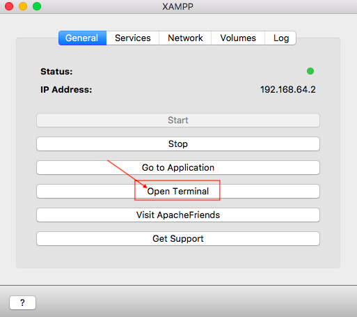
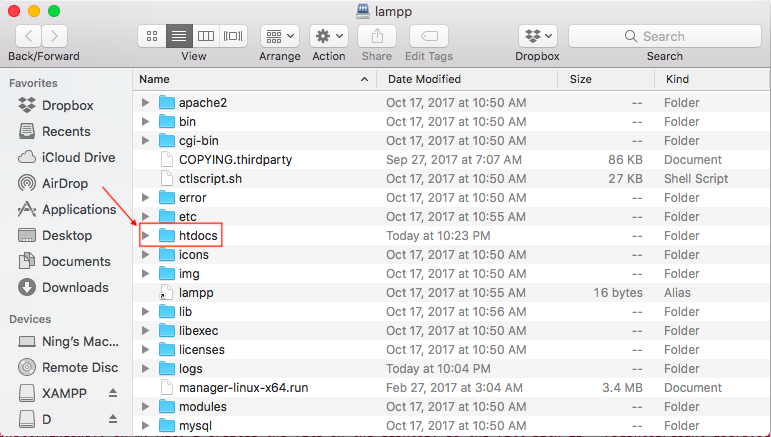
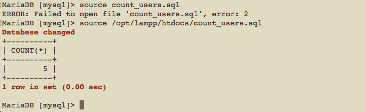

# CSCI 360 Spring 2021
# Dr. Ning Zhang
# Chapters 1,2,3 MySQL Introduction

# Objectives:
+ Learn the basics of MySQL
+ Learn the installation of MySQL(XAMPP)
+ Learn how to use XAMPP and MySQL monitor

# 1. Basics of MySQL
## What is MySQL
+ pronounced “My Ess Cue Ell”
+ **“the world’s most popular open source database,”** as the developers at the [MySQL AB corporation](http://www.mysql.com) claim
+ modest-sized database
+ MySQL is a relatively recent entrant into the well-established area of **relational database management systems (RDBMs)**
+ Structured Query Language (SQL)
  - insert, retrieve, and manipulate data.
+ We can interact with the database using the PHP and Perl programming languages, and allows interaction with your data over the medium most people prefer these days: the Web.
  
## Why Is MySQL so Popular?
+ The MySQL development process focuses on offering a very efficient implementation of the features most people need. 
  - This means that MySQL still has fewer features than its chief open source competitor, PostgreSQL, or the commercial database engines.
  - The skills you get from this book will serve you well on any platform.
  - MySQL HAS been the choice for so many beginners and small sites, and now for some heavyweight database users in government and industry.
+ Factors
  - Size and speed
  - Ease of installation
  - Attention to standards
  - Responsiveness to community
  - Easy interface to other software

## Elements of MySQL and Its Environment
+ A MySQL installation has two components: 
  - a server that manages the data
  - clients that ask the server to do things with the data
    + MySQL monitor program that allows you to connect to a MySQL server and run SQL queries.
    + mysqladmin program that allows you to perform various server administration tasks.
    + any program that knows how to talk to the MySQL server is a client (a program for a web-based shopping site or an application to generate sales graphs for a marketing team can both be clients).
      - web server vs. database server
        
  
+ Four aspects of using MySQL
  - MySQL server
  - SQL
    + core of MySQL use
  - Programming languages
    + a general-purpose programming language such as PHP or Perl to automatically create and execute SQL queries on the MySQL server.
  - Web database applications
    + you can use PHP or Perl to create dynamic, database-driven web applications that can publish information from the database to the Web, and capture information provided by users.

## The LAMP Platform
+ Linux operating system
+ Apache web server
+ MySQL database management system
+ Perl or PHP scripting language.

## Structured Query Language
+ language developed by IBM
+ still used today to interact with relational databases

# 2. Installation of MySQL
+ On textbook "Learning MySQL", Chapter 2 introduces the installation of the LAMP platform in details.
+ In our class, we use the XAMPP application.
  - [XAMPP Tutorial](XAMPP%20Tutorial.md)

# 3. Using the MySQL Monitor
+  client-server architecture
  - clients connect to the server to perform database operations
  
  
  
+ The standard MySQL command-line client or “monitor” program provided by MySQL AB is the client you’ll probably use the most often.
  - The monitor allows you to control almost all aspects of database creation and maintenance using SQL and the custom MySQL extensions to SQL.

## Starting the Monitor
+ The monitor program is called simply mysql and is found in a directory with the other MySQL programs. 
  - The exact location depends on your operating system and how you chose to install MySQL
    + you can locate the promgram from XAMPP directly
  
  
  
  
  
  
  
  - from the command line, you type
    ~~~~
    mysql --user=root
    ~~~~
    
    
    
    + Note: I am using MAC, the mysql program may look different on Windows, but all the commands we use in this class will be the same.
    + Note: The default password is NULL, if you have set up a password, you need to use the following command
    ~~~~
    mysql --user=root --password=the_mysql_root_password
    ~~~~
## Stoping the Monitor

~~~~
exit;
~~~~

or 

~~~~
quit;
~~~~

## Commands
+ version of MySQL
~~~~
SELECT VERSION();
~~~~

+ Note: Do NOT miss the ;

+ list all the databases 

~~~~
SHOW DATABASES;
~~~~
  

## Style, Case, and Semicolons
+ A command-line command is a combination of 
  - SQL keywords
  - MySQL proprietary commands
  - names of databases and database components
+ A command-line command is Not case-sensitive
  - e.g.: **show databases** is equivalent to **SHOW DATABASE**
+ A command-line command follows conventions for better readibility.
  - SQL keywords and MySQL proprietary commands are **UPPPERCASE**.
  - names of databases and database components are **lowercase**.
+ A command-line command ends with the semicolon character (;).

~~~~
SELECT User, Host
FROM user;
~~~~

## The Monitor HELP 
+ **HELP** lists commands the monitor understands.

+ **HELP Contents** gets help on how to interact with the MySQL server. 

+ **HELP Data Manipulation**  gets information on data manipulation

+ **HELP SHOW DATABASES** gets information on SHOW DATABASES command

## Running the Monitor in Batch Mode
+ run the following commands in interactive mode
~~~~
use mysql;
SELECT COUNT(*) FROM user;
~~~~

+ run the commands in batch mode
  - save the commands in a file with extension sql, e.g., count_users.sql
  - run the file using the followng command
  ~~~~
  SOURCE count_users.sql
  ~~~~
    + Note: 
      - If you do NOT use XAMPP, you need to specify the full path of the sql file if it is not in the current directory. The current directory is the directory when you open the terminal(MAC) or shell(windows). On my Mac, I created the file on the desktop, so the full path is "~/Desktop/count_users.sql". If you use Windows, the full path may look like "C:\folder_name\count_users.sql".
      - In our class, we use XAMPP, so if you want to execute the file, create/put it in the following folder.
    
      
    
      - To find the folder, click **Explore**
    
      
    
  - run the file using its full path
  
  
  
## Loading the Sample Databases
  - Download music.sql from http://tahaghoghi.com/LearningMySQL/downloads.php
  - Put the sql file in the correct folder
  - Run the file
    + MacOS
    ~~~~
    source /opt/lampp/htdocs/music.sql 
    ~~~~
    + Windows
    ~~~~
    source C:\xampp\htdocs\music.sql 
    ~~~~
  
## MySQL Monitor Program Options
+ The monitor program can take several parameters
  - host
    + The host the server is running on; you can leave this out if the server is running on the same host as the client (localhost).
  - user
    + The username to use when connecting to the MySQL server
  - password
    + The password of this user
      - no password
      ~~~~
      mysql --user=the_username
      ~~~~
      - prompt you for a password
      ~~~~
      mysql --user=the_username --password
      ~~~~
      - provide password with username
      ~~~~
      mysql --user=the_username --password=correct_password
      ~~~~
  - database
    ~~~~
    mysql --user=root --database=mysql
    ~~~~
    or
    ~~~~
    mysql --user=root mysql
    ~~~~
  - safe-updates
    + the following command will be prevented.
    ~~~~
    DELETE FROM user;
    ~~~~
## Graphical Clients
+ [MySQL Administrator](http://dev.mysql.com/downloads)
+ [MySQL Query Browser](http://dev.mysql.com/downloads)
+ XAMPP(we use XAMPP in our class, see [XAMPP Tutorial](XAMPP%20Tutorial.md) to learn how to open the graphical clients on the web browser.)
