# CSCI 360 Spring 2022
# Chapter 5: Basic SQL
+ SQL is the only database language in widespread use.
  - It was first proposed in the early 1970s.
  - The latest standard is SQL-2003.
  - MySQL supports most of the features of SQL-1992 and many from the newer SQL standards, but it also includes many non- standard features that give more control over the database server and how it evaluates queries and returns results.
+ Objectives
  - **SELECT** to read
  - **INSERT** to add
  - **UPDATE** to change
  - **DELETE** to remove
## Use the **music** database
+ You need to understand the batch mode example we leart in [Chapters 1, 2, and 3](../Slides/Chapter010203.md) to create the **music** database
+ It is also very important to understand the ER model of the **music** database in [Chapter 4](../Slides/Chapter04.md)
+ It is also very important to understand the ER model of the **music** database in [Chapter 4](../Slides/Chapter04.md)

    

    
+ Start the MySQL Monitor and choose the **music** database, and you can check that this is the active database by typing in the SELECT DATABASE( );
  

+ explore what tables make up the music database

+ explore the columns in a table

  - You can try to show the columns of the other tables.
  - To have a better understanding of the results, you can compare the results of the **SHOW COLUMNS FROM** with the ER model and the code.
  
    
# The SELECT Statement and Basic Querying Techniques
## Single Table SELECTs

+ A simple SELECT statement has four components:
  - The keyword SELECT.
  - The columns to be displayed. In our first example, we asked for all columns by using the asterisk (*) symbol as a wildcard character.
  - The keyword FROM.
  - The table name; in this example, the table name is artist.
## Choosing Columns
+ Choose one column

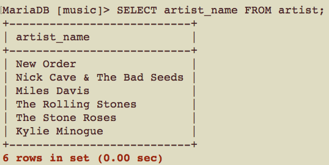

+ Choose more than one columns and display in order

+ You can even list columns more than once, this is useful when combined with aliases in more advanced queries in [Chapter 7](../Slides/Chapter07.md)

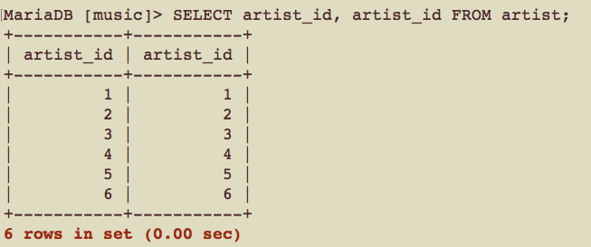

+ Specify databases, tables, and column names in a SELECT statement
  - to avoid the USE command
  - to helps resolve ambiguities, as we show later in “Joining Two Tables”

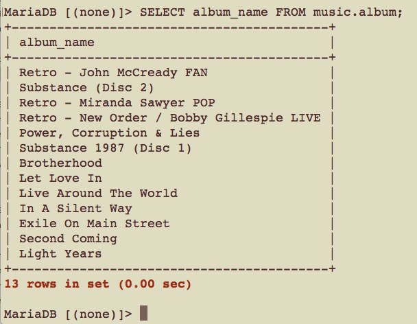

## Choosing Rows with the WHERE Clause
### WHERE basics
+ Used to return rows that match a condition
+ Example
  - find out the details of the artist with the name “New Order.”

  
  
  - find out the name of the artist with an artist_id value of 4.
  
  
  
  - more where conditions
  
  ~~~~
  SELECT track_name FROM track WHERE track_id = 13;
  SELECT artist_name FROM artist WHERE artist_id < 5;
  SELECT album_name FROM album WHERE album_id <> 2;
  ~~~~

+ Operators
  - equals (=)
  - greater than (>)
  - less than (<)
  - less than or equal (<=)
  - greater than or equal (>=)
  - not equal (<> or !=)
+ Note: you can us the operators both for numbers and strings.

~~~~
SELECT artist_name FROM artist WHERE artist_name < 'M';
~~~~

+ String match/wild cards
  - percentage character (%): zero or more characters
  
  
  
  - underscore character (\_): exactly one character
    + Note that there are two underscores and one spacebar in the following example.

  

### Combining conditions with AND, OR, NOT, and XOR

~~~~
SELECT album_name FROM album WHERE album_name > "C" AND album_name < "M";

SELECT album_name FROM album WHERE album_name LIKE "L%" OR album_name LIKE "S%" OR album_name LIKE "P%";
~~~~
~~~~
SELECT album_name FROM album WHERE album_name LIKE "L%" OR album_name LIKE "S%" AND album_name LIKE "%g";

SELECT album_name FROM album WHERE album_name LIKE "L%" OR (album_name LIKE "S%" AND album_name LIKE "%g");

SELECT album_name FROM album WHERE (album_name LIKE "L%" OR album_name LIKE "S%") AND album_name LIKE "%g";
~~~~
~~~~
SELECT * FROM album WHERE NOT (album_id = 1 OR album_id = 3);

SELECT * FROM album WHERE NOT (album_id = 1) AND NOT (album_id = 3);

SELECT * FROM album WHERE album_id != 1 AND album_id != 3;

SELECT * FROM album WHERE album_id != 1 AND NOT (album_id = 3);
~~~~
## ORDER BY Clauses
+ sort the results if we want them in a particular order.
+ Sorting has no effect on what is returned, and only affects what order the results are returned.
+ The ORDER BY clause indicates that sorting is required, followed by the column that should be used as the sort key.
+ The default sort is case-insensitive and in ascending order.

+ Multiple sort keys.
  - If the values of the first key are the same, the order will be determined by the second key.
  
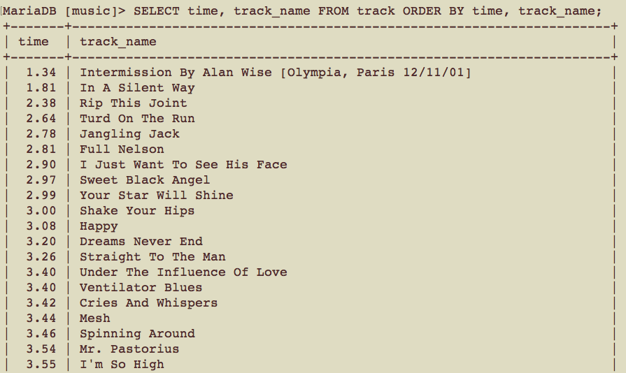

+ sort in descending order

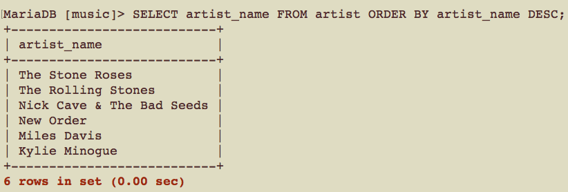

+ a mixture of ascending and descending orders
  - Note: WHERE always appears before ORDER BY in the SELECT statement.

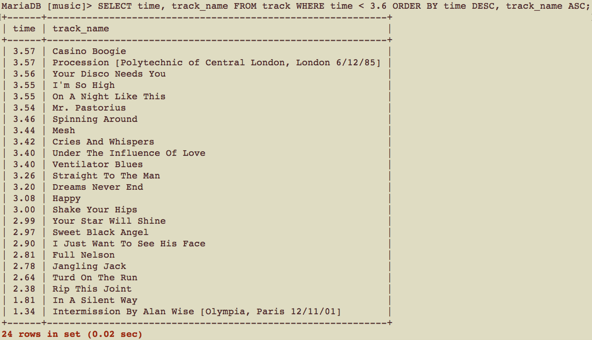

+ If you do want sorting to behave like ASCII does, you can add a BINARY keyword.
  - Example 1:
  ~~~~
  SELECT * FROM artist ORDER BY BINARY artist_name;
  ~~~~
  - Example 2: searching for tracks with names alphabetically earlier than the letter b(Compare the following two queries)
  
  ~~~~
  SELECT track_name FROM track WHERE track_name < 'b';
  SELECT track_name FROM track WHERE track_name < BINARY 'b';
  ~~~~

+ Treat a column as a different data type
  - Example: you want to sort the track table by ascending time, but you want the times to be treated as strings. 
  
  
  
  - data types
  
  ~~~~
  • AS BINARY, to sort as binary, which has the same effect as ORDER BY BINARY • AS SIGNED, to sort as a signed integer
  • AS UNSIGNED, to sort as an unsigned integer
  • AS CHAR, to sort as a character string
  • AS DATE, to sort as a date
  • AS DATETIME, to sort as a date and time • AS TIME, to sort as a time
  ~~~~
  

## The LIMIT Clause
+ The LIMIT clause is a useful, nonstandard SQL tool that allows you to control which rows are output.
+ Example 1: only display the first 10 rows

+ Example 2: display 10 rows, starting from the 6th row(note the index starts from 0)

+ Example 3: choose a start point, the display to the end of the table(you do not know how many rows, you can choose a relatively large number. Technically, the largest number you can use is 18446744073709551615).

## Joining Two Tables
+ working with the relationships between tables to answer information needs
+ We learn only one join(inner join) in this chapter, we'll learn more in [Chapter 7](../Slides/Chapter07.md)

+ syntax
  - two table names separated by the INNER JOIN keywords
  - the USING keyword that indicates which column (or columns) holds the relationship between the two tables
+ Note: to create a join query, you can use the ER model to help you understand which tables we need. You can use either the ER model we created in chapter 4 or an alternative which shows all the attributes of a table.

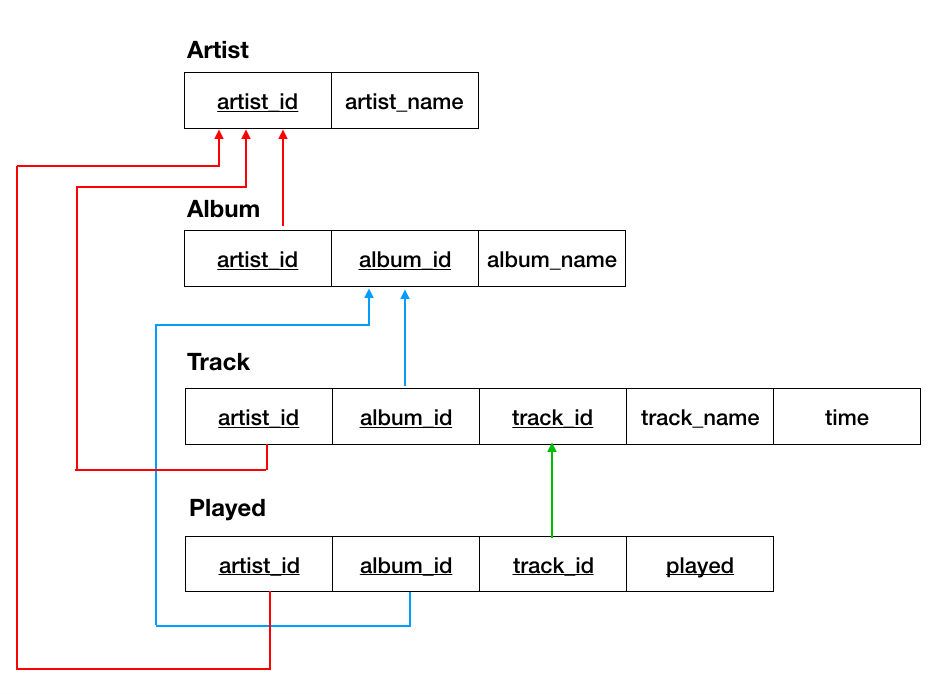

+ Example 1:

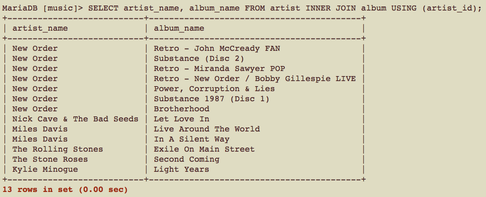

+ important issues
  - It works only when two tables share a column with the same name that you can use as the join condition; otherwise, you must use an alternative syntax described in [Chapter 7](../Slides/Chapter07.md)
  - The result rows shown are those where the join column (or columns) match between the tables; rows from one table that don’t have a match in the other table are ignored.
  - With the exception of the join column or columns after the USING keyword, any columns you specify must be unambiguous. 
    + What if we want artist\_id?
  - Don’t forget the USING clause.
  - The column or columns following the USING clause must be surrounded by parentheses.

+ Example 2: list the track names for all your albums

~~~~
SELECT album_name, track_name FROM album INNER JOIN track
USING (artist_id, album_id);
~~~~

~~~~
SELECT album_name, track_name FROM album INNER JOIN track
USING (artist_id, album_id)
ORDER BY album_name, track_id
~~~~

+ Example 3: find out which tracks you’ve played

~~~~
SELECT played, track_name FROM track INNER JOIN played 
USING (artist_id, album_id, track_id)
ORDER BY track.artist_id, track.album_id, track.track_id, played;
~~~~

+ One aggregate function: SUM()
  - Example: find out how long New Order’s Brotherhood album takes to play
  
  ~~~~
  SELECT SUM(time) FROM 
  album INNER JOIN track USING (artist_id, album_id)
  WHERE album.artist_id = 1 AND album.album_id = 7;
  ~~~~
  
  ~~~~
  /*discover New Order’s artist_id*/
  SELECT artist_id FROM artist WHERE artist_name = "New Order";
  ~~~~
  
  ~~~~
  /*discover the album_id of “Brotherhood”*/
  SELECT album_id FROM album
  WHERE artist_id = 1 AND album_name = "Brotherhood";
  ~~~~
  

# The INSERT Statement
## INSERT Basics

### Single Row Insertion
+ Syntax
~~~~
INSERT INTO table_name VALUES(value_for_column_1, value_for_column_2,...,value_for_column_m)
~~~~

+ Before we run the previous insert statement, we can try the following statements to see how the two values (7, "Barry Adamson") are determined.

~~~~
SHOW COLUMNS FROM artist;
SELECT MAX(artist_id) FROM artist;
~~~~

+ Then we can try the following statement to show the instance we just inserted.

~~~
SELECT * FROM artist WHERE artist_id = 7;
~~~

+ We can combine the MAX() function with INSERT together

~~~~
INSERT INTO artist
VALUES((SELECT 1+MAX(artist_id) FROM artist), "Barry Adamson");
~~~~

+ The statement above does not work, this is a typical MySQL thing, it can be solved by the following statement (the AS keyword). See Reference [here](
https://stackoverflow.com/questions/44970574/table-is-specified-twice-both-as-a-target-for-update-and-as-a-separate-source/44971214)
~~~~
INSERT INTO artist
VALUES((SELECT 1+MAX(artist_id) FROM artist AS max_id), "Barry Adamson");
~~~~

+ Another example(we need it for the bulk-load insertion example)

~~~~
INSERT INTO album VALUES (7, 1, "The Taming of the Shrewd");
~~~~

### Bulk-load Insertion
+ Syntax
~~~~
INSERT INTO table_name VALUES(value_1_for_column_1, value_1_for_column_2,...,value_1_for_column_m),
                              (value_2_for_column_1, value_2_for_column_2,...,value_2_for_column_m),
                              ...
                              (value_n_for_column_1, value_n_for_column_2,...,value_n_for_column_m);
~~~~

~~~~
INSERT INTO track VALUES (1, "Diamonds", 7, 1, 4.10),
                          (2, "Boppin Out / Eternal Morning", 7, 1, 3.22),
                          (3, "Splat Goes the Cat", 7, 1, 1.39),
                          (4, "From Rusholme With Love", 7, 1, 3.59);
~~~~

+ Note: The INSERT operation stops on the first duplicate key. You can add an IGNORE clause to prevent the error if you want. If you use INSERT IGNORE and try to insert a duplicate record for which the primary key matches that of an existing row, then MySQL will quietly skip inserting it and report it as a duplicate in the second entry on the final line.

~~~~
INSERT IGNORE INTO track VALUES (1, "Diamonds", 7, 1, 4.10),
                          (2, "Boppin Out / Eternal Morning", 7, 1, 3.22),
                          (3, "Splat Goes the Cat", 7, 1, 1.39),
                          (4, "From Rusholme With Love", 7, 1, 3.59);
~~~~
## Alternative Syntaxes
+ Disadvantages of the previou VALUE syntax
  - you need to remember the order of the columns,
  - you need to provide a value for each column,
  - it’s closely tied to the underlying table structure: if you change the table’s structure, you need to change the INSERT statements, and the function of the INSERT statement isn’t obvious unless you have the table structure at hand.
#### Alternative 1
+ Syntax
  - note that you do not need to provide all the column names.
  - All columns in a MySQL table have a default value of NULL unless another default value is explicitly assigned when the table is created or modified.
~~~~
INSERT INTO table_name (column_name_1,column_name_2,...,column_name_m) VALUES(value_for_column_1, value_for_column_2,...,value_for_column_m)
~~~~

+ Example 1: all columns

~~~~
INSERT INTO album (artist_id, album_id, album_name)
VALUES (7, 2, "Oedipus Schmoedipus");
~~~~

+ Example 2: some columns
  - insert
  ~~~~
  INSERT INTO played (artist_id, album_id, track_id)
  VALUES (7, 1, 1);
  ~~~~
  - After the insert statement, let's check the value of the missing column
  ~~~~
  SELECT * FROM played 
  WHERE artist_id = 7 AND album_id = 1;
  ~~~~
+ Example 3: bulk insertion
  
  ~~~~
  INSERT INTO played (artist_id, album_id, track_id)
  VALUES (7,1,2),(7,1,3),(7,1,4);
  ~~~~

+ Example 4: 
  - add a row with only default values
  ~~~~
  INSERT INTO played () VALUES ();
  ~~~~
  - check the result
  ~~~~
  SELECT * FROM played 
  ORDER BY played DESC 
  LIMIT 1;
  ~~~~
+ Example 5: set default and still use the original INSERT syntax
  
  ~~~~
  INSERT INTO played VALUES (7, 1, 2, DEFAULT);
  ~~~~

#### Alternative 2
+ Syntax
~~~~
INSERT INTO table_name 
SET column_name_1 =  value_1, column_name_2 =  value_2,...,column_name_m =  value_m;
~~~~
+ Example
~~~~
INSERT INTO played
SET artist_id = 7, album_id = 1, track_id = 1;
~~~~

# The DELETE Statement
+ We only discuss single-table delete here. Let's learn multi-table deletes in [Chapter 8](../Slides/Chapter08.md).
+ Make sure you reload the music database first before trying any of the following examples.
## DELETE Basics
+ Delete all the rows
  - Note: it does not delete the table.
~~~~
DELETE FROM played;
~~~~

## Using WHERE, ORDER BY, and LIMIT
+ To remove one or more rows, but not all rows in a table, you use a WHERE clause.
~~~~
/*Note: yyyy-mm-dd format is recommended*/
DELETE FROM played WHERE played < "2006-08-15";
~~~~
+ It is complicated to deal with foreign keys.

~~~~
DELETE FROM artist WHERE artist_id = 3;
~~~~
+ Limit the number of rows deleted
  - Typically, when you’re deleting, you use LIMIT and ORDER BY together; it usually doesn’t make sense to use them separately.
~~~~
/*remove the 528 oldest rows*/
DELETE FROM played ORDER BY played LIMIT 528;
~~~~
## Removing All Rows with TRUNCATE
+ By using the TRUNCATE TABLE statement, MySQL takes the shortcut of dropping the table—that is, removing the table structures and then re-creating them.
+ When there are many rows in a table, this is much faster.

~~~~
TRUNCATE TABLE played;
~~~~

+ The TRUNCATE TABLE statement has two other limitations:
  - It’s actually identical to DELETE if you use InnoDB tables.
  - It does not work with locking or transactions.
# The UPDATE Statement
+ The UPDATE statement is used to change data.
+ Make sure you reload the music database first before trying any of the following examples.
## Update all rows
+ Example 1:
  - Note: The function UPPER( ) is a MySQL function that returns the uppercase version of the text passed as the parameter.
~~~~
UPDATE artist SET artist_name = UPPER(artist_name);
~~~~

+ Example 2:

~~~~
/*set all played dates and times to the current date and time*/
UPDATE played SET played = NULL;
~~~~
## Update one or more rows that match a condition
+ Example 1:

~~~~
UPDATE album SET album_name = "Substance 1987 (Disc 2)"
WHERE artist_id = 1 AND album_id = 2;
~~~~

+ To control how many updates occur, you can use the combination of ORDER BY and LIMIT. 

~~~
UPDATE played SET played = NULL ORDER BY played DESC LIMIT 10;
~~~

# Exploring Databases and Tables with SHOW and mysqlshow
+ SHOW DATABASE

+ mysqlshow: You can get the same effect from the command line using the mysqlshow program.
~~~~
mysqlshow --user=root --password=the_mysql_root_password
~~~~

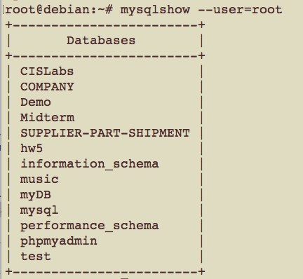

+ You can add a LIKE clause to SHOW DATABASES

~~~~
SHOW DATABASES LIKE "m%";
~~~~

+ To see the statement used to create a database, you can use the SHOW CREATE DATABASE statement.

~~~~
SHOW CREATE DATABASE music;
~~~~

+ The SHOW TABLES statement lists the tables in a database

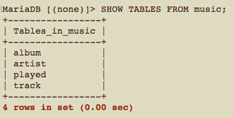

+ If you’ve already selected the music database with the USE music command,you can use the shortcut:

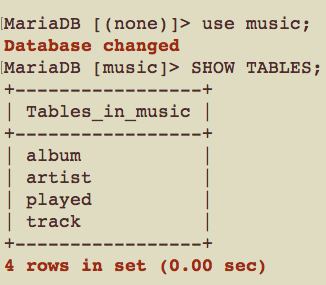

+ You can get a similar result by specifying the database name to the mysqlshow program.

~~~~
mysqlshow --user=root --password=the_mysql_root_password database_name
~~~~

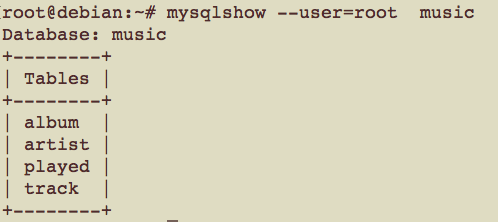

+ The SHOW COLUMNS statement lists the columns in a table

~~~~
SHOW COLUMNS FROM track;
~~~~

+ You can get a similar result by using mysqlshow with the database and table name:

~~~~
mysqlshow --user=root --password=the_mysql_root_password database_name table_name
~~~~

+ You can see the statement used to create a particular table using the SHOW CREATE TABLE statement.

~~~~
SHOW CREATE TABLE track;
~~~~
