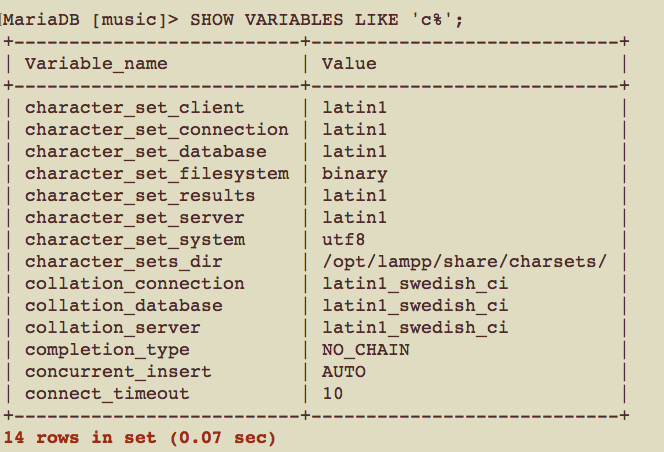

# CSCI360 Spring 2021
# Chapter 6 Working with Database Structures
+ Objectives: dealing with **METADATA**
  - create database
  - create tables, including columns
  - alter structures
  - delete structures
# Creating and Using Databases
+ Syntax
~~~~
CREATE DATABASE database_name;
~~~~

+ Example(Assume the music database has not been created)

+ If the dabases has already existed, the statement above yields an error.

+ So we revise the syntax to avoid such error.

~~~~
CREATE DATABASE IF NOT EXISTS database_name;
~~~~

+ Conventions and Restrictions
  - use lowercase names for databases to make your SQL machine-independent
    + case-sensitive in Mac OS and Linux
    + case-insensitive in Windows
  - max lenght: 64 characters
  - don't use reserved words (SELECT, FROM, USE...)
  - don't use special characters(slash, back slash, semicolon, period)
  - don't use whitespace as the last character for a database name
  
  ~~~~
  CREATE DATABASE IF NOT EXISTS mus;ic
  -- CREATE DATABASE IF NOT EXISTS mus; is a vailid statement, database mus will be created
  -- ic is not a valid statement, it yields one error.
  ~~~~
# Creating Tables

## Basics
+ Make sure the **music** database is "empty"(no tables have been created). If the dabased with tables has been loaded, run the following statements to drop the database and create it again, then you can create tables.

+ Syntax for a table
~~~~
CREATE TABLE table_name(
column_1_defination,
column_2_defination,
...
column_m_defination,
optional_key_definition
);
~~~~

+ Syntax for a column
~~~~
name type [NOT NULL | NULL] [DEFAULT value]
~~~~
  - **name**: fewer limitations, but better to consistently choose lowercase names for developer-driven choices (such as database, alias, and table names) and avoid characters that require you to remember to use backticks.
  - **type**: data type(how the data is stored? e.g. CHAR for strings, SMALLINT for numbers, or TIMESTAMP for a date and time...)
  - **NOT NULL | NULL**: valid **with | without** a value
  - **DEFAULT value**: If you specify a value with the DEFAULT clause, it’ll be used to populate the column when you don’t otherwise provide data.
    + The value must be a constant (such as 0, "cat", or 20060812045623), except if the column is of the type TIMESTAMP.
    + Sometimes, the DEFAULT value workks. Sometimes, it doesn't.
    ~~~~
    -- assume no rows in table artist
    INSERT INTO artist SET artist_name = "Duran Duran";
    INSERT INTO artist SET artist_name = "Bob The Builder";
    ~~~~
## Collation and Character Sets
+ When you’re comparing or sorting strings, how MySQL evaluates the result depends on the character set and collation used.
+ **Character sets** define what characters can be stored.
+ A **collation** defines how strings are ordered.
+ The default character set is latin1, and the default collation is latin1\_swedish\_ci.
+ You can list the character sets available on your server with the SHOW CHARACTER SET command.

+ You can list the collation orders and the character sets they apply to.

+ You can see the current defaults on your server as follows:

+ When you’re creating a database, you can set the default character set and sort order for the database and its tables.

~~~~
CREATE DATABASE music DEFAULT CHARACTER SET latin1 COLLATE latin1_swedish_cs;
~~~~

## Other Features
+ **IF NOT EXISTS**

+ **AUTO_INCREMENT**
+ **Column comments**
  - add a comment to a column; displayed when you use the SHOW CREATE TABLE command
+ **Foreign key constraints**
  - We don’t recommend using foreign key constraints for most applications.
  - This feature is currently supported for only the InnoDB table type.
+ **Creating temporary tables**
  - The table will be removed (dropped) when the monitor connection is closed.

+ **Advanced table options**
  - the starting value of AUTO_INCREMENT
  - the way indexes and rows are stored
  - options to override the information that the MySQL query optimizer gathers from the table
+ **Control over index structures**
  - For some table types, you’ve been able to control what type of internal structure—such as a B-tree or hash table—MySQL uses for its indexes. You can also tell MySQL that you want a full text or spatial data index on a column, allowing special types of search.
###  SHOW CREATE TABLE
+ display some advanced options
  - The names of the table and columns are enclosed in backticks. This isn’t necessary, but it does avoid any parsing problems that can occur through using reserved words and special characters.
  - An additional default ENGINE clause is included, which explicitly states the table type that should be used. The setting in a default installation of MariaDB(XAMPP platform) is InnoDB, while MyISAM for MySQL.
  - AnadditionalDEFAULT CHARSET=latin1 clause is included.

## Column Types
### Common column types
+ Six common types.
#### INT[(width)] [UNSIGNED] [ZEROFILL]
+ INT and INTEGER are interchangable.
+ [UNSIGNED]
  - 4 bytes INTEGER
  - range –2,147,483,648 to 2,147,483,647 if no UNSIGNED option
  - range 0 to 4,294,967,295 if UNSIGNED
+ [(width)] [ZEROFILL]
  - maximum width is 255
  - The width parameter has no effect on what is stored.
  - left-pad with zeros
  - If you use ZEROFILL, MySQL automatically adds UNSIGNED to the declaration (since zero filling makes sense only in the context of positive numbers).
  - If you store a value wider than the width, the width value is ignored.
  - example
  
  
  
#### DECIMAL[(width[,decimals])] [UNSIGNED] [ZEROFILL]
+ DECIMAL, DEC, NUMERIC, and FIXED are interchangable.
+ (width[,decimals])
  - a total of **width** digits of which some smaller number are **decimals** that follow a decimal point.
  - The maximum value of width is 255.
  - The default value of widht is 10.
  - The default value of decimals is 0.
  - If you’re storing only positive values, use the UNSIGNED keyword.
  - If you want zero padding, use the ZEROFILL keyword
  - If you try to store a value that’s outside this range, it will be stored as the closest value in the allowed range.
  - example: DECIMAL(4,2) has a range from -99.99 to 99.99
#### DATE
+ format for input and output: YYYY-MM-DD
+ range 1000-01-01 to 9999-12-31
+ valid MM 0-12
+ valid DD 0-31
+ other formats for input(not recommended)
  - YYYY-MM-DD or YY-MM-DD
  - YYYY/MM/DD, YYYY:MM:DD, YY/MM/DD
  - YYYY-M-D, YYYY-MM-D, or YYYY-M-DD
  - YYYYMMDD or YYMMDD
+ The zero date 0000-00-00 is allowed in all versions and can be used to represent an unknown or dummy value. If an input date is out of range or invalid(2021-02-29), the zero date 0000-00-00 is stored.

#### TIME
+ format for input and output: HHH:MM:SS
+ range -838:59:59 to 838:59:59(The values that can be stored are outside the range of the 24-hour clock to allow large differences between time values (up to 34 days, 22 hours, 59 minutes, and 59 sec- onds) to be computed and stored.)
+ other formats: DD HH:MM:SS, HH:MM:SS, DD HH:MM, HH:MM, DD HH, or SS
  - Example: If you insert 2 13:25:59 into a TIME type column, the value 61:25:59 is stored
+ If you try inserting a value that’s out of bounds, a warning is generated, and the value is limited to the maximum time available.
+ You can use the **SHOW WARNINGS** command to report the details of the warning generated by the previous SQL statement.

+ H:M:S, and single-, double-, and triple-digit combinations

~~~
CREATE TABLE mytime (testtime TIME);

INSERT INTO mytime VALUES
('-1:1:1'), ('1:1:1'),
('1:23:45'), ('123:4:5'),
('123:45:6'), ('-123:45:6');
~~~

+ HHMMSS, MMSS, and SS: Punctuation can be omitted, but the digit sequences must be two, four, or six digits in length.

#### TIMESTAMP
+ format YYYY-MM-DD HH:MM:SS
+ range 1970-01-01 00:00:00 to sometime in 2037.
+ The behavior of this type has varied over the life of MySQL (and continues to do so!). Check the documentation frequently.
+ If you assign NULL to it, it’s set to the current date and time.
+ A developer-selected TIMESTAMP column in a table can be automatically updated to the current date and time when a row is inserted or updated. You control this by following these steps when creating a table:
  - Choose the column you want to be automatically updated.
  - If you have other TIMESTAMP columns in the table, set the ones that precede the selectedcolumnintheCREATE TABLEstatementtohaveaconstantdefault(such as DEFAULT 0).
  - For the automatically updating column, decide which behavior you want:
    + If you want the timestamp to be set only when a new row is inserted into the table, add DEFAULT CURRENT_TIMESTAMP to the end of the column declaration.
    + If you don’t want a default timestamp but want the current time to be used whenever the data in a row is updated, add ON UPDATE CURRENT_TIME STAMP to the end of the column declaration.
    + If you want both of the above—that is, you want the timestamp to be set to the current time in each new row or whenever an existing row is modified add **DEFAULT CURRENT_TIMESTAMP ON UPDATE CURRENT_TIMESTAMP** to the end of the column declaration.
    + DEFAULT NULL is handled a sDEFAULT CURRENT_TIMESTAMP for the first timestamp column, but as DEFAULT 0 for any subsequent ones.
  - Example:
  ~~~~
  CREATE TABLE mytime(id INT NOT NULL,
  changetime TIMESTAMP DEFAULT CURRENT_TIMESTAMP ON UPDATE CURRENT_TIMESTAMP);
  
  INSERT INTO mytime VALUES(1,''),(2,'2006-07-16 1:2:3'),(3,NULL);
  
  SELECT * FROM mytime;
  ~~~~
  
  
  ~~~~
  UPDATE mytime SET id=4 WHERE id=1;
  SELECT * FROM mytime;
  ~~~~
+ Other formats: 
  - YYYY-MM-DD HH:MM:SS or YY-MM-DD HH:MM:SS
  - YYYYMMDDHHMMSS or YYMMDDHHMMSS
#### CHAR[(width)]
+ The most commonly used string type.
+ The maximum value of width is 255.
+ MySQL accepts values greater than 255 and silently changes the CHAR type to the smallest TEXT type that is suitable.
+ If a width is not provided, CHAR(1) is assumed.
+ You can in fact define a special CHAR(0) NULL column that takes up only one bit of storage. 
  - First, it allows you to include a dummy column in a table that doesn’t do anything (which might be useful as a placeholder for a future feature, or to be backward-compatible with an old application).
  - Second, it allows you to store one of two values: NULL or the empty string '', giving you very compact storage of binary (Boolean) values.
  
  
### Other integer types
#### BOOLEAN
+ two values: false(zero) and true(non-zero)
+ synonyms: BOOL and BIT
+ equivalent to TINYINT(1) and CHAR(0)
#### TINYINT[(width)] [UNSIGNED] [ZEROFILL]
+ range: –128 to 127 or  0 to 255 when [UNSIGNED]
#### SMALLINT[(width)] [UNSIGNED] [ZEROFILL]
+ range: –32,768 to 32,767 or  0 to 65,535 when [UNSIGNED]
#### MEDIUMINT[(width)] [UNSIGNED] [ZEROFILL]
+ range:  –8,388,608 to 8,388,607 or 0 to 16,777,215 when [UNSIGNED]
#### BIGINT[(width)] [UNSIGNED] [ZEROFILL]
+ range: –9,223,372,036,854,775,808 to 9,223,372,036,854,775,807 or 0 to 18,446,744,073,709,551,615 when [UNSIGNED]
### Other rational number types
+ DOUBLE(REAL) and FLOAT: accurate approximate representations of exact quantities
+ Note: DECIMAL stores the exact values.
#### FLOAT[(width, decimals)] [UNSIGNED] [ZEROFILL] or FLOAT[(precision)] [UNSIGNED] [ZEROFILL]
#### DOUBLE[(width, decimals)] [UNSIGNED] [ZEROFILL]
~~~~
CREATE TABLE wage (monthly DOUBLE);

INSERT INTO wage VALUES (50000/12);

SELECT monthly*12 FROM wage;
~~~~

### Other date and time types
#### YEAR[(digits)]
+ Stores a two- or four-digit year
+ four digits is the default
#### DATETIME
+ format: YYYY-MM-DD HH:MM:SS
+ range 1000-01-01 00:00:00 to 9999-12-31 23:59:59
+ If you assign only a date to a DATETIME column, the zero time 00:00:00 is assumed. 
+ If you assign only a time to a DATETIME column, the zero date 0000-00-00 is assumed.
+ This type does not have the automatic update features of TIMESTAMP.
### Other string types
#### VARCHAR(width)
+ stores variable-length strings 
+ maximum value of width is 65,535
#### BINARY(width) and VARBINARY(width)
#### BLOB
+ The commonly used type for storing large data.
+ Stores a variable amount of data (such as an image, video, or other nontext file) up to 65,535 bytes in length.
+ The data is treated as binary—that is, no character set is assumed, and comparisons and sorts are case-sensitive.
#### TEXT
+ A commonly used type for storing large string data objects.
+ It is identical to BLOB, except that the data is treated as belonging to a character set.
#### TINYBLOB and TINYTEXT
+ Identical to BLOB and TEXT, respectively, except that a maximum of 255 bytes can be stored.
#### MEDIUMBLOB and MEDIUMTEXT
+ Identical to BLOB and TEXT, respectively, except that a maximum of 16,777,215 bytes can be stored.
#### LONGBLOB and LONGTEXT
+ Identical to BLOB and TEXT, respectively, except that a maximum of four gigabytes of data can be stored.
#### ENUM('value1'[,'value2'[, ...]]
+ A list, or enumeration of string values. 
+ A column of type ENUM can be set to a value from the list value1, value2, and so on, up to a maximum of 65,535 different values.
+ what’s stored in the database is an integer representation.
+ The enumerated column can contain NULL (stored as NULL), the empty string '' (stored as 0), or any of the valid elements (stored as 1, 2, 3, and so on)
+ when you try to store anything that’s not in the valid values, an empty string is stored instead.

~~~~
CREATE TABLE fruits_enum ( fruit_name ENUM('Apple', 'Orange', 'Pear') );
INSERT INTO fruits_enum VALUES ('Apple');
INSERT INTO fruits_enum VALUES ('Banana'); 
-- The previous statament yields a warning, you can use SHOW WARNINGS to display the warning information
SHOW WARNINGS;
INSERT INTO fruits_enum VALUES ('Apple,Orange'); -- warning again
SELECT * FROM fruits_enum;
~~~~
+ You can also specify a default value other than the empty string:
~~~~
CREATE TABLE new_fruits_enum ( fruit_name ENUM('Apple', 'Orange', 'Pear') -> DEFAULT 'Pear');
INSERT INTO new_fruits_enum VALUES();
~~~~
#### SET('value1'[,'value2'[, ...]])
+ A set of string values. 
+ A column of type SET can be set to zero or more values from the list value1, value2, and so on, up to a maximum of 64 different values.
+ While the values are strings, what’s stored in the database is an integer representation.
+ each row can store only one ENUM value in a column, but can store multiple SET values.

~~~~
CREATE TABLE fruits_set ( fruit_name SET('Apple', 'Orange', 'Pear') );
INSERT INTO fruits_set VALUES ('Apple');
INSERT INTO fruits_set VALUES ('Banana');
-- The previous statament yields a warning, you can use SHOW WARNINGS to display the warning information
SHOW WARNINGS;
INSERT INTO fruits_set VALUES ('Apple,Orange'); -- no warnings with multiple values
SELECT * FROM fruits_set;
~~~~

## Keys and Indexes
### Primary key
+ A primary key uniquely identifies each row in a table.
### Index
+ When you declare one to MySQL, it creates a new file on disk that stores information about where the data from each row in the table is stored. 
+ This information is called an index, and its purpose is to speed up searches that use the primary key. 
+ Without the index, the only way to find rows in the table is to read each one from disk and check whether it matches the artist_id(primary key) you’re searching for.
+ You can display the indexes available on a table using the SHOW INDEX command.
  - The cardinality is the number of unique values in the index.
  - All columns that are part of a primary key must be declared as NOT NULL.
 

  

+ You can create other indexes on the data in a table. You do this so that other searches —on other columns or combinations of columns—are extremely fast and in order to avoid sequential scans.

~~~~
-- DROP statement may fail due to the foreign key constraint, you can replace the CREATE statement in music.sql then run it in batch mode.
-- Or use the music.sql with no foreign key constraint to create the database.(There are two music.sql files on the website of the textbook)
DROP TABLE artist;

CREATE TABLE artist (
  artist_id SMALLINT(5) NOT NULL DEFAULT 0,
  artist_name CHAR(128) DEFAULT NULL,
  PRIMARY KEY (artist_id),
  KEY artist_name (artist_name)
  );
~~~~

~~~~
CREATE TABLE customer (
  cust_id INT(4) NOT NULL DEFAULT 0,
  firstname CHAR(50),
  secondname CHAR(50),
  surname CHAR(50),
  PRIMARY KEY (cust_id),
  KEY names (firstname, secondname, surname)
  );
~~~~

+ You can use the EXPLAIN statement to check the fast searching by combinations of the three name columns.

+ For MySQL to be able to use an index, the query needs to meet both the following conditions:
  - The leftmost column listed in the KEY (or PRIMARY KEY) clause must be in the query.
  - The query must contain no OR clauses for columns that aren’t indexed.
+ When you’re considering adding an index, think about the following:
  - Indexes cost space on disk, and they need to be updated whenever data changes.
  - Only add an index that’ll be used frequently.
  - If all columns in an index are used in all queries, list the column with the highest number of duplicates at the left of the KEY clause.
  - The smaller the index, the faster it’ll be. 
  - For long columns, you can use only a prefix of the values from a column to create the index
    + The following example means that only the first three characters of firstname are indexed, then the first two characters of secondname, and then 10 characters from surname. 
  ~~~~
  KEY names (firstname(3), secondname(2), surname(10))
  ~~~~
## The AUTO_INCREMENT Feature
+ The AUTO_INCREMENT feature has the following requirements:
  - The column it is used on must be indexed.
  - The column that is it used on cannot have a DEFAULT value.
  - There can be only one AUTO_INCREMENT column per table.
~~~~
DROP TABLE artist;

CREATE TABLE artist (
  artist_id SMALLINT(5) NOT NULL AUTO_INCREMENT,
  artist_name CHAR(128) DEFAULT NULL,
  PRIMARY KEY (artist_id)
  );
  
INSERT INTO artist VALUES (NULL, "The Shamen");
INSERT INTO artist VALUES (NULL, "Probot");
INSERT INTO artist VALUES (NULL, "The Cult");

SELECT * FROM artist;
~~~~

+  When you’re using the default MyISAM table type, you can use the AUTO_INCREMENT feature on keys that comprise multiple columns. 
  - The following statement i invalid on XAMPP plotform, because the table taye is innoDB by default, we'll learn different table types in [Chapter 7](../Slides/Chapter07.md).
~~~~
CREATE TABLE album1 (
  artist_id INT(5) NOT NULL,
  album_id INT(4) NOT NULL AUTO_INCREMENT,
  album_name CHAR(128) DEFAULT NULL,
  PRIMARY KEY (artist_id, album_id)
  );
~~~~
## The Sample Music Database
+ The music.sql file is structured as follows:
  - Drop the database if it exists, and then create it.
  - Use the database.
  - Create the tables.
  - Insert the data.
### Drop the database if it exists, and then create it.
~~~
DROP DATABASE IF EXISTS music;
CREATE DATABASE music;
~~~
### Use the database
~~~~
USE music;
~~~~
### Create the tables
~~~~
CREATE TABLE artist (
  artist_id SMALLINT(5) NOT NULL DEFAULT 0,
  artist_name CHAR(128) DEFAULT NULL, 
  PRIMARY KEY (artist_id)
  );

CREATE TABLE album (
  artist_id SMALLINT(5) NOT NULL DEFAULT 0, 
  album_id SMALLINT(4) NOT NULL DEFAULT 0, 
  album_name CHAR(128) DEFAULT NULL, 
  PRIMARY KEY (artist_id,album_id)
  );

CREATE TABLE track (
  track_id SMALLINT(3) NOT NULL DEFAULT 0, 
  track_name CHAR(128) DEFAULT NULL, 
  artist_id SMALLINT(5) NOT NULL DEFAULT 0, 
  album_id SMALLINT(4) NOT NULL DEFAULT 0, 
  time TIME DEFAULT NULL,
  PRIMARY KEY (artist_id,album_id,track_id) 
  );

CREATE TABLE played (
  artist_id SMALLINT(5) NOT NULL DEFAULT 0,
  album_id SMALLINT(4) NOT NULL DEFAULT 0,
  track_id SMALLINT(3) NOT NULL DEFAULT 0,
  played TIMESTAMP NOT NULL DEFAULT CURRENT_TIMESTAMP on update CURRENT_TIMESTAMP, 
  PRIMARY KEY (artist_id,album_id,track_id,played)
  );
~~~~
+ Note:
  - in table played, the played column makes use of the TIMESTAMP type and its automatic-update feature: we want the value to be set to the current date and time whenever a row is inserted. To use the feature, whenever we play a track, we create a new row with the artist\_id, album_id, and track\_id, and set the played column to NULL.
# Altering Structures
## Adding, Removing, and Changing Columns
### Rename a column
+ Syntax
~~~~
ALTER TABLE table_name CHANGE original_column_name new_column_definition;
~~~~
+ Example
~~~~
ALTER TABLE played CHANGE played last_played TIMESTAMP;
~~~~
### modify the type and clauses of a column, but not its name
+ Syntax 1
~~~~
ALTER TABLE table_name MODIFY new_column_definition_with_original_column_name;
~~~~
+ Example
~~~~
ALTER TABLE artist MODIFY artist_name CHAR(64) DEFAULT "Unknown";
~~~~
+ Syntax 2
~~~~
ALTER TABLE artist CHANGE original_column_name new_column_definition_with_original_column_name;
~~~~
+ Example
~~~~
ALTER TABLE artist CHANGE artist_name artist_name CHAR(64) DEFAULT "Unknown";
~~~~
+ Note
  - 1. Don’t use incompatible types(e.g. INT -> DATE)
  - 2. Don’t truncate the data unless that’s what you want. 
### add an extra column 
+ Syntax
~~~~
ALTER TABLE table_name ADD column_definition;
~~~~
+ Example
~~~~
ALTER TABLE artist ADD formed YEAR;
~~~~
+ If you want it to instead be the first column, use the FIRST keyword as follows:
~~~~
ALTER TABLE artist ADD formed YEAR FIRST;
~~~~
+ If you want it added in a specific position, use the AFTER keyword:
~~~~
ALTER TABLE artist ADD formed YEAR AFTER artist_id;
~~~~
### remove a column,
+ Syntax
  - This removes both the column structure and any data contained in that column.
  - It also removes the column from any index it was in; if it’s the only column in the index, the index is dropped, too. 
  - You can’t remove a column if it’s the only one in a table; to do this, you drop the table instead.
~~~~
ALTER TABLE table_name DROP column_name;
~~~~
+ Example
~~~~
ALTER TABLE artist DROP formed;
~~~~
### specify multiple alterations in a single ALTER TABLE statement
+ Syntax
~~~~
ALTER TABLE table_name alteration1, alteration2, ... ;
~~~~
+ Example
~~~
ALTER TABLE artist ADD formed YEAR, MODIFY artist_name char(256);
~~~
## Adding, Removing, and Changing Indexes
+ Modifying indexes does not affect the data stored in the table.
### add a new index
+ Syntax
~~~
ALTER TABLE table_name ADD INDEX index_name (column_name(s));
~~~
+ Example
~~~
ALTER TABLE artist ADD INDEX by_name (artist_name);
~~~
### Specify a primary key (for a table after it’s created)
+ Syntax
~~~~
ALTER TABLE table_name ADD PRIMARY KEY (column_name(s));
~~~~
+ Example
~~~~
ALTER TABLE artist ADD PRIMARY KEY (artist_id);
~~~~
### remove an index
+ Syntax
~~~~
ALTER TABLE table_name DROP INDEX index_name;
~~~~
+ Example
~~~
ALTER TABLE artist DROP INDEX by_name;
~~~
### drop a primary key
+ Syntax
~~~~
ALTER TABLE table_name DROP PRIMARY KEY;
~~~~
+ Example
~~~~
ALTER TABLE artist DROP PRIMARY KEY;
~~~~

### change a primary key
+ MySQL won’t allow you to have multiple primary keys in a table. If you want to change the primary key, you’ll have to remove the existing index before adding the new one.
~~~~
CREATE TABLE staff (staff_id INT, name CHAR(40));
ALTER TABLE staff ADD PRIMARY KEY (staff_id);
-- the following statement tries to add another primary key, which is invalid
ALTER TABLE staff ADD PRIMARY KEY (name); 

ALTER TABLE staff DROP PRIMARY KEY;
ALTER TABLE staff ADD PRIMARY KEY (name);
~~~~
### change an index
You can’t modify an index once it’s been created. If you want to change an index, you'll have to drop the index and then create it again with the new specification.
~~~~
ALTER TABLE artist DROP INDEX by_name;

-- by_name index includes only the first 10 characters of the artist_name
ALTER TABLE artist ADD INDEX by_name (artist_name(10));
~~~~

## Renaming Tables and Altering Other Structures
### Rename a table
+ Syntax(**TO** keyword is optional)
~~~~
ALTER TABLE table_name RENAME TO new_table_name;
~~~~
+ Example
~~~~
ALTER TABLE played RENAME TO playlist;
~~~~
+ There are several other things you can do with ALTER statements(See [ALTER TABLE Statement Documentation](https://dev.mysql.com/doc/refman/5.7/en/alter-table.html) ):
  - Change the default character set and collation order for a database, a table, or a column.
  - Change the order of the rows in a table. This is useful only if you know you want to access the rows in a particular order and you want to help get the data into or near that order.
  - Manage and change constraints. For example, you can add and remove foreign keys.
### Rename a database
+ Syntax
~~~~
RENAME DATABASE old_database_name new_database_name;
~~~~
# Deleting Structures
## Dropping Databases
+ Syntax
~~~~
DROP DATABASE database_name;

DROP DATABASE IF EXISTS database_name;
~~~~
## Removing Tables
+ Syntax
~~~~
DROP TABLE table_name;

DROP TABLE IF EXISTS table_name;

DROP TABLE IF EXISTS table_name1, table_name2,...;
~~~~
