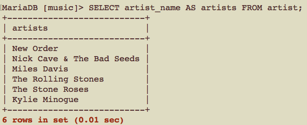

# CSCI360 Spring 2021
# Chapter 7: Advanced Querying
+ Complete SELECT Query
~~~~
SELECT DISTINCT column, AGG_FUNC(column_or_expression), …
FROM mytable
    JOIN another_table
      ON mytable.column = another_table.column
    WHERE constraint_expression
    GROUP BY column
    HAVING constraint_expression
    ORDER BY column ASC/DESC
    LIMIT count 
    OFFSET COUNT;
~~~~
+ Query order of execution

# Aliases
+ Aliases are nicknames for columns, tables, or function name, allowing you to:
  -  Write shorter queries
  -  Express your queries more clearly
  -  Use one table in two or more ways in a single query
  -  Access data more easily from programs (for example, from PHP scripts, as dis- cussed in [Chapter 14](../Slides/Chapter14.md))
  -  Use special types of nested queries; these are the subject of “Nested Queries,” discussed later in this chapter
## Column Aliases
+ individual column(s)
~~~~
SELECT column_name1 AS alias_name1, column_name2 AS alias_name2, ... 
FROM table_name
...;
~~~~

+ concatenated columns (with strings)
  - The MySQL function CONCAT( ) concatenates together the strings
  - Column names and strings can be in any order.
  - After we create an alias, we can use it throughout the query. 
    + For example, if we do not use an alias in the following query, you need to write the `ORDER BY` clause as `ORDER BY CONCAT(artist_name, " recorded ", album_name)`.
~~~
SELECT CONCAT(column_name1, string1, column_name2, string2 ...) AS alias_name
FROM table_name
...;
~~~

+ **Column aliases can NOT be use in WHERE clause, or in the USING and ON clauses**

+ **Column aliases can be use in ORDER BY, GROUP BY, and HAVING clauses**
+ The AS keyword is optional (using the AS keyword is recommended).

~~~~
SELECT artist_id AS id FROM artist WHERE artist_name = "New Order";
SELECT artist_id id FROM artist WHERE artist_name = "New Order";
~~~~

+ They can be at most 255 characters in length and can contain any character. 
+ If you plan to use characters that might confuse the MySQL parser—such as periods, commas, or semicolons—make sure you enclose the alias name in backticks. 
+ We recommend using lowercase alphanumeric strings for alias names and using a consistent character choice—such as an underscore—to separate words. 
+ Aliases are case-insensitive on all platforms.

## Table Aliases
+ Syntax: after defining the alias, you can use `alias_name` in other clauses.
~~~~
table_name AS alias_name
~~~~
+ Example
~~~~
SELECT ar.artist_id, al.album_name, ar.artist_name 
FROM album AS al INNER JOIN artist AS ar
USING (artist_id) WHERE al.album_name = "Brotherhood";
~~~~
+ there are no restrictions on where table aliases can be used in queries.
+ the AS keyword is optional.
+ table aliases allow you to write queries that you can’t otherwise easily express.
  - Example: Find out if two or more artists have released an album of the same name and, if so, what the identifiers for those artists are.
  ~~~
  SELECT a1.artist_id, a2.album_id
  FROM album AS a1, album AS a2 
  WHERE a1.album_name = a2.album_name AND a1.artist_id != a2.artist_id;
  ~~~
  

# Aggregating Data
+ Aggregate functions allow you to discover the properties of a group of rows.
## The DISTINCT Clause
+ more of a post-processing filter that allows you to remove duplicates.
~~~
SELECT DISTINCT clumn_name1, column_name2, ... FROM 
...;
~~~
+ Compare the following three queries.
~~~
SELECT artist_name FROM
artist INNER JOIN album USING (artist_id);

SELECT DISTINCT artist_name FROM
artist INNER JOIN album USING (artist_id);

SELECT DISTINCT artist_name, album_name FROM 
artist INNER JOIN album USING (artist_id);
~~~

+ To remove duplicates, MySQL needs to sort the output. You should use DISTINCT (and other aggregate functions) with caution on large data sets.
## The GROUP BY Clause
+ The GROUP BY clause sorts data into groups for the purpose of aggregation. 
+ GROUP BY is used to organize the data before other clauses — such as WHERE, ORDER BY, and functions — areapplied.
+ ORDER BY is applied last — after the query has been resolved — to reorganize the query output for display.
+ COUNT( ) function can count off the number of instances/rows in each group.
  - Note: `COUNT(artist_name)` is the same as `COUNT(*)` or `COUNT(artist_id)` in the following query.
~~~~
SELECT artist_name, COUNT(artist_name) FROM
artist INNER JOIN album USING (artist_id)
GROUP BY artist_name;
~~~~
+ Muti-way INNER JOIN in one query: find out how many tracks are on each album, along with the artist and album name.

~~~~
SELECT artist_name, album_name, COUNT(*) FROM
artist INNER JOIN album USING (artist_id)
INNER JOIN track USING (artist_id, album_id)
GROUP BY artist.artist_id, album.album_id;
~~~~

+ More example: find out how many times we’ve listened to tracks on each album with the artist and album names.
~~~~
SELECT artist_name, album_name, COUNT(*) FROM
artist INNER JOIN album USING (artist_id)
INNER JOIN track USING (artist_id, album_id)
INNER JOIN played USING (artist_id, album_id, track_id)
GROUP BY album.artist_id, album.album_id;
~~~~

+ Use GROUP BY clause without an aggregate function is meaningless
~~~~
SELECT * FROM track GROUP BY artist_id;
~~~~

### Other aggregate functions
+ AVG( ): Returns the average (mean) of the values in the specified column for all rows in a group.

+ MAX( ): Returns the maximum value from rows in a group.
+ MIN( ): Returns the minimum value from rows in a group.
+ STD( ) or STDDEV( ): Returns the standard deviation of values from rows in a group.
+ SUM( ): Returns the sum of values from rows in a group
+ other functions: see [MySQL manual under the heading “GROUP BY (Aggregate) Functions.”](http://download.nust.na/pub6/mysql/doc/refman/5.1/en/group-by-functions.html)
## The HAVING Clause
+ The HAVING Clause adds additional control to the aggregation of rows in a GROUP BY operation.
+ The HAVING clause must contain an expression or column that’s listed in the SELECT clause.
+ Typically, the expression in the HAVING clause uses an aggregate function such as COUNT( ), SUM( ), MIN( ), or MAX( ).
+ If you find yourself wanting to write a HAVING clause that uses a column or expression that isn’t in the SELECT clause, chances are you should be using a WHERE clause instead.
+ The HAVING clause is only for deciding how to form each group or cluster, not for choosing rows in the output. 
+ Example 1: find out albums if you’ve listened to one or more of its tracks at least five times.
~~~~
SELECT artist_name, album_name, COUNT(*) FROM
artist INNER JOIN album USING (artist_id)
INNER JOIN track USING (artist_id, album_id)
GROUP BY artist.artist_id, album.album_id
HAVING COUNT(*) >= 5;
~~~~
+ Example 2: list the albums that have more than 10 tracks, together with the number of tracks they contain. 
~~~~
SELECT artist_name, album_name, COUNT(*) FROM
artist INNER JOIN album USING (artist_id)
INNER JOIN track USING (artist_id, album_id)
GROUP BY artist.artist_id, album.album_id
HAVING COUNT(*) > 10;
~~~~
+ Example 3: how many tracks are on albums by New Order
    - the HAVING clause should be used to decide what rows should form each group, NOT used to filter the answers to display.
    - To filter the answers, the WHERE clause should be used.
    
~~~~
SELECT artist_name, album_name, COUNT(*) FROM
artist INNER JOIN album USING (artist_id)
INNER JOIN track USING (artist_id, album_id)
GROUP BY artist.artist_id, album.album_id
HAVING artist_name = "New Order";
~~~~

~~~~
SELECT artist_name, album_name, COUNT(*) FROM
artist INNER JOIN album USING (artist_id)
INNER JOIN track USING (artist_id, album_id)
WHERE artist_name = "New Order"
GROUP BY artist.artist_id, album.album_id;
~~~~
# Advanced Joins
## The Inner Join
+ The INNER JOIN clause matches rows between two tables based on the criteria you provide in the **USING** clause.

~~~~
SELECT artist_name, album_name FROM
artist INNER JOIN album USING (artist_id);
~~~~
+ the **WHERE** clause (no INNER JOIN)

~~~~
SELECT artist_name, album_name FROM artist, album
WHERE artist.artist_id = album.artist_id;
~~~~

+ the Inner JOIN clause with the **ON** clause

~~~~
SELECT artist_name, album_name FROM 
artist INNER JOIN album
ON artist.artist_id = album.artist_id;
~~~~

## The Union
+ The UNION allows you to combine the output of more than one SELECT statement to give a consolidated result set.
+ Example 1: create a list of the first artist and the last artist.

~~~~
(SELECT * FROM artist
ORDER BY artist_id ASC
LIMIT 1)
UNION
(SELECT * FROM artist
ORDER BY artist_id DESC
LIMIT 1);
~~~~

+ The UNION operator has several limitations:
    - The output is labeled with the names of the columns or expressions from the first query. Use column aliases to change this behavior.
    ~~~
    SELECT artist_id FROM artist
    UNION
    SELECT artist_name FROM artist;
    ~~~
    - The queries should output the same number of columns. If you try using different numbers of columns, MySQL will report an error.
    - All matching columns should have the same type.
    - The results returned are unique, as if you’d applied a DISTINCT to the overall result set. If you want to show any duplicates, replace UNION with UNION ALL.
    ~~~~
    SELECT artist_id FROM artist
    UNION
    SELECT artist_id FROM artist;
    ~~~~
    
    ~~~~
    SELECT artist_id FROM artist
    UNION ALL
    SELECT artist_id FROM artist;
    ~~~~
    - If you want to apply LIMIT or ORDER BY to an individual query that is part of a UNION statement, enclose that query in parentheses. It’s useful to use parentheses anyway to keep the query easy to understand.
    - For efficiency, MySQL will actually ignore an ORDER BY clause within a subquery if it’s used without LIMIT.
    - The output of a UNION operation isn’t guaranteed to be ordered, even if the subqu- eries are ordered, so if you want the final output to be ordered, you should add an ORDER BY clause at the end of the whole query:
    ~~~~
    (SELECT track_name, played
    FROM track INNER JOIN played USING (artist_id, album_id, track_id)
    ORDER BY played ASC)
    UNION ALL
    (SELECT track_name, played
    FROM track INNER JOIN played USING (artist_id, album_id, track_id)
    ORDER BY played DESC LIMIT 5)
    ORDER BY played;
    ~~~~
    
    ~~~
    (SELECT artist_name FROM artist WHERE artist_id < 5)
    UNION
    (SELECT artist_name FROM artist WHERE artist_id > 7)
    ORDER BY artist_name LIMIT 4;
    ~~~
## The Left and Right Joins
+ What if we need the information discarded by INNER JOIN?

+ Example: list the track names that have not been played?
~~~~
SELECT track_name, played FROM
track LEFT JOIN played USING (artist_id, album_id, track_id)
ORDER BY played DESC;
~~~~
### LEFT JOIN
+ A **LEFT JOIN** works like this: each row in the left table—the one that’s doing the driving—is processed and output, with the matching data from the second table if it exists and NULL values if there is no matching data in the second table.
+ The order of the tables in the LEFT JOIN is important.(LEFT JOIN is driven by the LEFT table)

~~~~
SELECT track_name, played FROM
played LEFT JOIN track USING (artist_id, album_id, track_id)
ORDER BY played DESC;
~~~~

+ Example: list all albums, even those that have never been played

~~~
SELECT artist_name, album_name, COUNT(played) FROM
artist INNER JOIN album USING (artist_id)
INNER JOIN track USING (artist_id, album_id)
LEFT JOIN played USING (artist_id, album_id, track_id)
GROUP BY album.artist_id, album.album_id;
~~~

### RIGHT JOIN
+ whatever is on the right drives the process

~~~~
SELECT track_name, played FROM
played RIGHT JOIN track USING (artist_id, album_id, track_id)
ORDER BY played DESC;
~~~~

## The Natural Join
+ you tell MySQL what tables you want to join, and it figures out how to do it and gives you an INNER JOIN result set. 
+ The following two queries are equivalent.
~~~
SELECT artist_name, album_name FROM artist NATURAL JOIN album;
~~~

~~~
SELECT artist_name, album_name FROM
artist INNER JOIN album USING (artist_id);
~~~
+ If identifier columns don’t share the same name, natural joins won’t work.
# Nested Queries
## Nested Query Basics: 
+ The outer query uses the output of the inner query.
~~~~
SELECT artist_name FROM artist WHERE artist_id =
(SELECT artist_id FROM album WHERE album_name = "In A Silent Way");
~~~~
+ Inner Query: (SELECT artist_id FROM album WHERE album_name = "In A Silent Way")
+ Outer Query: SELECT artist_name FROM artist WHERE artist_id = 
+ The nested query is equivalent to a non-nested query
~~~~
SELECT artist_name FROM
artist INNER JOIN album USING (artist_id)
WHERE album_name = "In A Silent Way";
~~~~
+ Nested queries are hard to optimize, and so they’re almost always slower to run than the unnested alternative, but sometimes it’s your only choice.
+ Example: List which track you listened to most recently.
~~~~
SELECT track_name FROM track INNER JOIN played
USING (artist_id, album_id, track_id)
WHERE played = (SELECT MAX(played) FROM played);
~~~~
## The ANY, SOME, ALL, IN, and NOT IN Clauses
+ Run the following statements
~~~~
CREATE TABLE producer (
producer_id SMALLINT(4) NOT NULL DEFAULT 0, 
producer_name CHAR(128) DEFAULT NULL,
years SMALLINT(3) DEFAULT 0,
PRIMARY KEY (producer_id));

INSERT INTO producer VALUES
(1, "Phil Spector", 36),
(2, "George Martin", 40),
(3, "Tina Weymouth", 20), 
(4, "Chris Frantz", 20),
(5, "Ed Kuepper", 15);

CREATE TABLE engineer (
engineer_id SMALLINT(4) NOT NULL DEFAULT 0, 
engineer_name CHAR(128) DEFAULT NULL,
years SMALLINT(3) DEFAULT 0,
PRIMARY KEY (engineer_id));

INSERT INTO engineer VALUES
(1, "George Martin", 40), 
(2, "Eddie Kramer", 38),
(3, "Jeff Jarratt", 40),
(4, "Ed Stasium", 25);
~~~~
### ANY and IN
+ ANY instance of the inner query results
+ Example: find engineers who’ve been working longer than the least experienced producer. 

~~~
SELECT engineer_name, years
FROM engineer WHERE years > ANY 
(SELECT years FROM producer);
~~~

~~~
SELECT engineer_name, years
FROM engineer WHERE years > 
(SELECT MIN(years) FROM producer);
~~~
+ Example: list the producers who are also engineers.

~~~~
SELECT producer_name FROM producer WHERE 
producer_name = ANY
(SELECT engineer_name FROM engineer);
~~~~
~~~~
SELECT producer_name FROM producer WHERE producer_name 
IN (SELECT engineer_name FROM engineer);
~~~~

~~~~
SELECT producer_name FROM producer INNER JOIN engineer
ON (producer_name = engineer_name);
~~~~
### ALL
+ ALL instance of the inner query results
+ Example: find engineers who are more experienced than all of the producers.
~~~
SELECT engineer_name, years
FROM engineer WHERE years > ALL 
(SELECT years FROM producer);
~~~
### NOT IN, <> ANY, or != ANY

~~~
SELECT engineer_name FROM engineer WHERE 
engineer_name NOT IN
(SELECT producer_name FROM producer);
~~~

### Writing row subqueries
+ the inner query returns multiple columns from multiple rows.
+ The row subquery syntax allows you to compare multiple values per row.
+ Example: engineers that have been a producer for the same length of time.
    - solution 1: inner join
    ~~~~
    SELECT producer_name, producer.years FROM
    producer, engineer WHERE producer_name = engineer_name AND 
    producer.years = engineer.years;
    ~~~~
    - solution 2: subquery
    ~~~
    SELECT producer_name, years FROM producer WHERE 
    (producer_name, years) IN
    (SELECT engineer_name, years FROM engineer);
    ~~~
## The EXISTS and NOT EXISTS Clauses

### EXISTS and NOT EXISTS basics
+ Syntax: the WHERE condtion is TRUE if the inner query returns at least one row.
~~~~
OUTER QUERY WHERE EXISTS
(INNER QUERY)
~~~~
+ Example
~~~~
SELECT * FROM artist WHERE EXISTS
(SELECT * FROM played);

SELECT album_name FROM album WHERE EXISTS
(SELECT * FROM artist WHERE artist_name = "John Coltrane");

SELECT * FROM producer WHERE NOT EXISTS
(SELECT * FROM artist WHERE artist_name = "New Order");
~~~~
### Correlated subqueries
+ Tables listed in the outer query are allowed to be accessed in the subquery(You can use values from the outer query in the inner query to evaluate complex information needs.).
+ Example: list all artists who’ve produced a self-titled album. 

~~~~
INSERT INTO artist VALUES (7, "The Beatles");
INSERT INTO album VALUES (7, 1, "The Beatles");

SELECT artist_name FROM artist WHERE EXISTS
(SELECT * FROM album WHERE album_name = artist_name);
~~~~
+  example using EXISTS: find all artists from whom we own at least two albums.
~~~~~
SELECT artist_name FROM artist WHERE EXISTS
(SELECT * FROM album WHERE artist.artist_id = album.artist_id
GROUP BY artist.artist_id HAVING COUNT(*) >= 2);
~~~~~
## Nested Queries in the FROM Clause
+ Example
~~~
SELECT producer_name, months FROM
(SELECT producer_name, years*12 AS months FROM producer) AS prod;
~~~
+ Note: this “derived table” in the FROM clause must have an alias, the following query will have some error.
~~~
SELECT producer_name, months FROM
(SELECT producer_name, years*12 AS months FROM producer);
~~~
+ Example
~~~
SELECT AVG(albums) FROM
(SELECT COUNT(*) AS albums FROM artist INNER JOIN album
USING (artist_id) GROUP BY artist.artist_id) AS alb;
~~~
# User Variables
+ A variable allows you to store a result and use it later.
+ Syntax
~~~
@variable_name := result
~~~
+ Example
~~~
SELECT @artist:=artist_name FROM artist WHERE artist_id = 1;
~~~
+ Use a variable
~~~
SELECT @artist;
~~~
+ Set a variable
~~~~
SET @counter := 0;

SET @counter := 0, @age:=23;
~~~~

+ Example
~~~~
SELECT @recent := MAX(played) FROM played;

SELECT track_name FROM track INNER JOIN played
USING (artist_id, album_id, track_id)
WHERE played = @recent;
~~~~
+ Guidelines on using user variable
    - User variables are unique to a connection: variables that you create can’t be seen by anyone else, and two different connections can have two different variables with the same name.
    - The variable names can be alphanumeric strings and can also include the period (`.`), underscore (`_`), and dollar (`$`) characters.
    - Variable names are case-sensitive in MySQL versions earlier than version 5, and case-insensitive from version 5 onward.
    - Any variable that isn’t initialized has the value NULL; you can also manually set a variable to be NULL.
    - Variables are destroyed when a connection closes.
    - You should avoid trying to both assign a value to a variable and use the variable as part of a SELECT query. Two reasons for this are that the new value may not be available for use immediately in the same statement, and a variable’s type is set when it’s first assigned in a query; trying to use it later as a different type in the same SQL statement can lead to unexpected results.
    ~~~~
    SELECT @aid, @aid:=artist.artist_id, @aid FROM artist,album
    WHERE album.artist_id=@aid;
    ~~~~
# Transactions and Locking
## Locking
+ When a database is concurrently accessed by several users, you have to consider how you may be affected if other users change the data that you’re accessing, and how changes you make may affect other users.
+ `Locks` can be applied to prevent concurrent users from interacting destructively with one other’s data.
    - A `read lock` allows you to prevent other users from changing data while you’re reading and processing the data.
    - A `write lock` tells other users that the data is being changed and that they should not read or modify it.
## Transcation
+ In some cases, you want all or none of a series of operations to succeed.
+ `Transactions` allow you to batch together SQL statements as an indivisible set that either succeeds or has no effect on the database. 
+ At the conclusion, you have the option of committing (saving) the transaction to the database or rolling back (canceling) the transaction.
# Table Types
+ MyISAM, InnoDB...
+ only the InnoDB table type supports foreign-key constraints.
+ You can use the `SHOW TABLE STATUS` command to display technical information about how your tables are stored.
+ The `SHOW ENGINES` command displays a list of all table types and indicates whether they’re available for use on your MySQL installation.
## Create or Alter table types
+ If you followed the instructions in Chapter 1 to install MySQL, 
~~~~
CREATE TABLE mytable (field INT(2)) type=MyISAM;

ALTER TABLE artist type = InnoDB;
~~~~
+ If you use XAMPP
~~~~
~~~~
CREATE TABLE mytable (field INT(2)) type=MyISAM;

ALTER TABLE artist ENGINE = InnoDB;
~~~~
~~~~
## Check table taype
+ syntax
~~~~
SHOW CREATE TABLE table_name；
~~~~
## MyISAM
+ It’s an all-around performer that’s designed for typical applications; it supports very fast querying and has very low overhead for changes to data. It’s also very flexible.
## Memory or Heap
+ Two terms(memory and heap) are interchangeable.
+ The Memory table type is useful when you want to force data to be in main memory and not on disk.
## InnoDB
+ The InnoDB type is the heavyweight, reliable, high-performance choice for large-scale, highly reliable applications.
+ Features:
    - Support for transactions
    - Advanced crash recovery features
    - Row-level locking
    - Foreign-key support
    - Fast, flexible indexing
+ Limitations:
    - More features means more to understand
    - It’s difficult to set up
    - It’s disk-hungry
    - Locking overheads
### Transaction examples
+ Transactions are the key feature that make InnoDB different from MyISAM.
+ Example: no need to use the first two ALTER commands because we are using XAMPP in this class and the default table type is InnoDB.
~~~
-- ALTER TABLE artist type = InnoDB;
-- ALTER TABLE album type = InnoDB;

START TRANSACTION;
INSERT INTO artist VALUES (8, "The Cure");
INSERT INTO album VALUES (8, "The Who");
COMMIT;
~~~

~~~
START TRANSACTION;
INSERT INTO artist VALUES (8, "The Cure");
INSERT INTO album VALUES (8, 1, "Disintegration");
ROLLBACK;
~~~
## BDB
+ The Berkeley Database (BDB) table type can survive the same types of database crashes as the InnoDB table type, and also has the COMMIT and ROLLBACK functionality we showed you in the previous section.
+ Features:
    - Transaction support
    - Advanced crash-recovery features
    - Page-level locking
    - Fast primary-key indexing
+ Limitations:
    - Gamma-quality interface and limited support
    - It’s disk-hungry, like InnoDB
    - It’s difficult to set up
+ Note: BDB is not supported in XAMPP.
