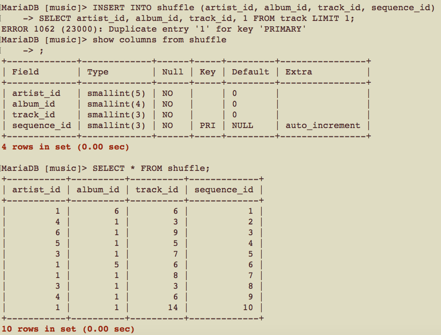
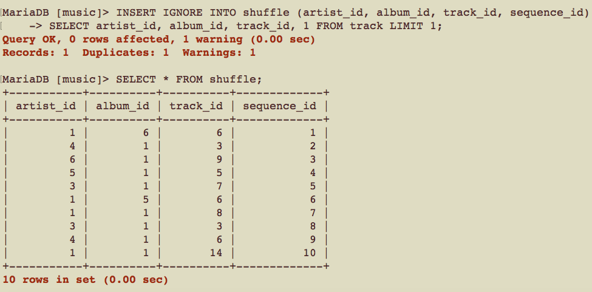
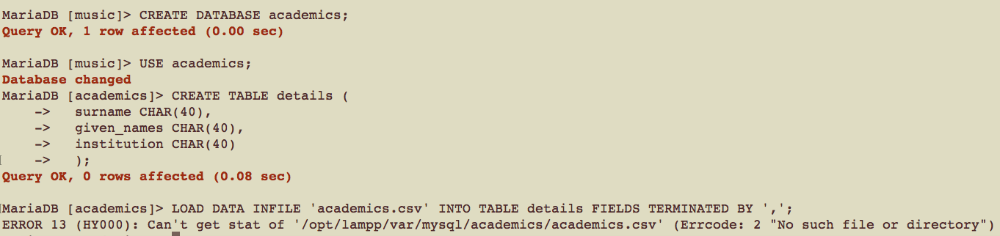
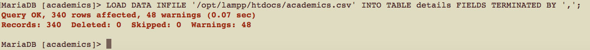
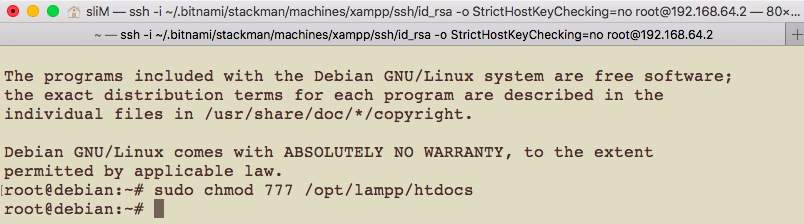
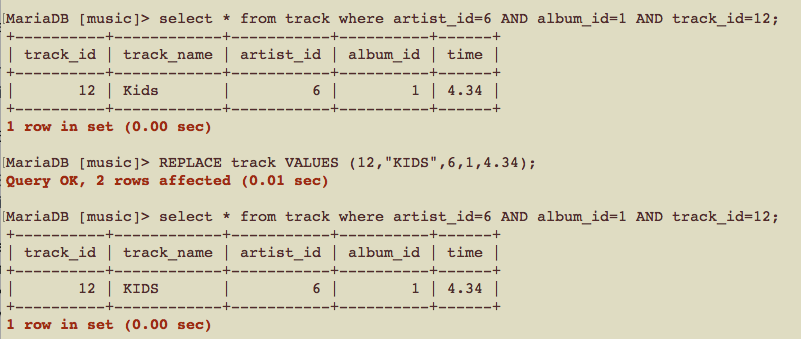
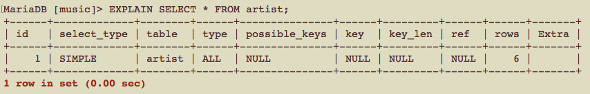
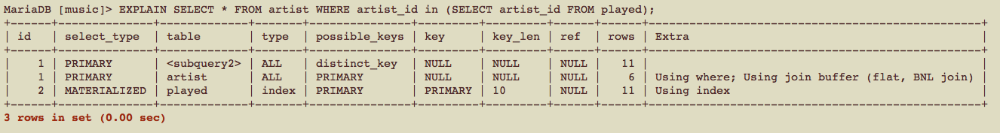
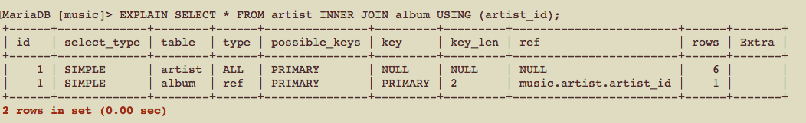
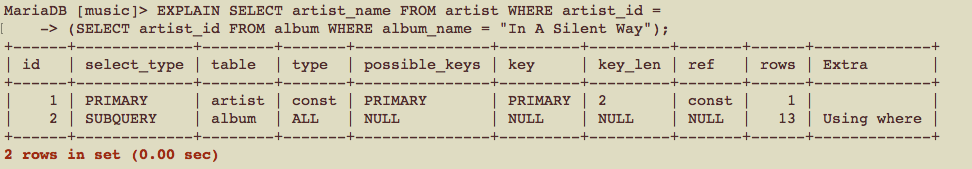

# CSCI360 Spring 2021
# Chapter 8: Doing More with MySQL
+ In this chapter, you’ll learn how to:
  - Insert data into a database from other sources, including with queries and from text files
  - Perform updates and deletes using multiple tables in a single statement
  - Replace data
  - Use MySQL functions in queries to meet more complex information needs
  - Analyze queries using the `EXPLAIN` statement and then improve their performance with simple optimization techniques
+ Note: we are still using the music database in this chapter.
# 1.Inserting Data Using Queries
+ Let's create a new table `shuffle`
~~~~
CREATE TABLE shuffle (
  artist_id SMALLINT(5) NOT NULL DEFAULT 0,
  album_id SMALLINT(4) NOT NULL DEFAULT 0,
  track_id SMALLINT(3) NOT NULL DEFAULT 0,
  sequence_id SMALLINT(3) AUTO_INCREMENT NOT NULL,
  PRIMARY KEY (sequence_id)
  );
~~~~
+ To insert data into this table, we can use the results of a SELECT statement.
  - The SELECT statement outputs a list of columns that must match the type and order of the list provided for the INSERT INTO statement (or the implicit, complete list if one isn’t provided)
  - the sequence_id is auto- matically created using MySQL’s AUTO_INCREMENT feature, and so isn’t specified in the statements.
  - ORDER BY RAND( ): this orders the results according to the MySQL function RAND( ). The RAND( ) function returns a pseudorandom number in the range 0 to 1.
  - The SELECT statement in an INSERT INTO statement can use all of the features of SELECT statements. You can use joins, aggregation, functions, and any other features you choose. 
~~~~
INSERT INTO shuffle (artist_id, album_id, track_id)
SELECT artist_id, album_id, track_id FROM
track ORDER BY RAND() LIMIT 10;
~~~~
+ You can also query data from one database into another, by prefacing the table names with the database name followed by a period (.) character.
~~~~
CREATE DATABASE art;
USE art;
CREATE TABLE people (
  people_id SMALLINT(4) NOT NULL,
  name CHAR(128) NOT NULL,
  PRIMARY KEY (people_id));

INSERT INTO art.people (people_id, name)
SELECT artist_id, artist_name FROM music.artist;
~~~~
+ When you try to insert duplicate key values, MySQL will abort.

+ If you want MySQL to ignore this and keep going, add an IGNORE keyword after the INSERT.
  - MySQL doesn’t complain, but it does report that it encountered a duplicate. 

# 2.Loading Data from Comma-Delimited Files
+ A staggeringly large amount of time spent by IT professionals is devoted to reformatting data from one application to suit another.
+ It is common that having data in comma-separated values (CSV) files, then the design of a database.
+ We only focus on importing csv data in this section, if you need to convert other files to csv files, you can use:
  - the [xls2csv script](http://search.cpan.org/~ken/xls2csv) to automate the conversion from the Excel spread- sheet files to text files of comma-separated values.
  - tools such as sed and awk to convert text data into a CSV format suitable for import by MySQL. 
+ Download academics.csv from [link 1](http://tahaghoghi.com/LearningMySQL/downloads.php) or [link 2](https://github.com/ZhangNingSAU/Spring-2021-CSCI-360-Database-Mgmt-Systems/blob/main/Resources/academics.csv)
+ Import the data from the csv file
~~~~
CREATE DATABASE academics;
USE academics;
CREATE TABLE details (
  surname CHAR(40), 
  given_names CHAR(40),
  institution CHAR(40)
  );

LOAD DATA INFILE 'academics.csv' INTO TABLE details FIELDS TERMINATED BY ',';
~~~~

+ If the academics.csv file isn’t in the current directory, you’ll need to specify the full path.

# 3.Writing Data into Comma-Delimited Files
~~~
USE music;

SELECT artist_name, album_name FROM artist, album 
WHERE artist.artist_id=album.artist_id;
~~~
+ We can change this SELECT query slightly to write this data into an output file as comma-separated values:
  - By default, the permission of the htdocs directory does NOT include writability. 
    + If you are using MacOS, You need to change the permission(You may need to enter your password).
  
    
    
    + If you are using Windows, run XAMPP as administrator.
    
    
    
    
  - If you are using Windows OS,  you can also use the following command
    ~~~
    cacls C:\xampp\htdocs\ /g everyone:f
    ~~~
  - If the file has exsited, there will be an error(You need to delete that file first).
~~~~
SELECT artist_name, album_name FROM artist, album 
WHERE artist.artist_id=album.artist_id
INTO OUTFILE '/opt/lampp/htdocs/artists_and_albums.csv' FIELDS TERMINATED BY ',';
~~~~
# 4.Creating Tables with Queries
+ You can create a table or easily create a copy of a table using a query.
## duplicate the structure of a table 
+ syntax
~~~~
CREATE TABLE new_table_name LIKE existing_table_name;
~~~~
+ The LIKE syntax allows you to create a new table with exactly the same structure as another, including keys.
+ It doesn’t copy the data across.
+ You can also use the IF NOT EXISTS and TEMPORARY features with this syntax.
+ Example
~~~
CREATE TABLE artist_2 LIKE artist;

DESCRIBE artist_2;

SELECT * FROM artist_2;
~~~
## create a table and copy some data
### creata a table with the same structures
+ Syntax
~~~~
CREATE TABLE new_table_name a_query
~~~~
+ Example
~~~
CREATE TABLE artist_3 SELECT * from artist;

SELECT * FROM artist_3;
~~~
### create a table with new structures
+ Syntax
~~~~
CREATE TABLE new_table_name (new_structures) a_query
~~~~
+ Example
~~~~
CREATE TABLE report (artist_name CHAR(128), album_name CHAR(128))
SELECT artist_name, album_name FROM artist INNER JOIN album
USING (artist_id);

SELECT * FROM report;

~~~~
+ **It doesn’t copy the indexes (or foreign keys, if you use them)**
  - Note: primary key is also an index.
~~~~
DESCRIBE artist_2;

SHOW CREATE TABLE artist_2;
~~~~
  - to solve this problem: 
    + 1. use the LIKE statement to create the empty table with the indexes, then copy the data across using an INSERT with a SELECT statement as described earlier in this chapter in “Inserting Data Using Queries.”
    + 2. use CREATE TABLE with a SELECT statement, and then add indexes using ALTER TABLE as described in Chapter 6.
    + 3. The third way is to use the UNIQUE (or PRIMARY KEY or KEY) keyword in combination with the CREATE TABLE and SELECT to add a primary-key index.( The keywords UNIQUE and PRIMARY KEY can be interchanged.)
    ~~~
    CREATE TABLE artist_2 (UNIQUE(artist_id))
    SELECT * FROM artist;
    
    DESCRIBE artist_2;
    ~~~
 - You can use different modifiers when you’re creating tables using these techniques.
 ~~~~
 CREATE TABLE artist_3
 (artist_id SMALLINT(5) NOT NULL AUTO_INCREMENT,
 artist_name CHAR(128) NOT NULL DEFAULT "New Order",
 PRIMARY KEY (artist_id), KEY (artist_name))
 SELECT * FROM artist;
 ~~~~
# 5.Updates and Deletes with Multiple Tables
+ delete or update rows from more than one table in one statement and can use those or other tables to decide what rows to change.
## 5.1 Deletion
+ Example 1: DELETE from one table
  - task: remove tracks you’ve never listened to
  - First, let's take a look at how to `select tracks you’ve never listened to`.
  ~~~~
  SELECT track_name FROM track WHERE NOT EXISTS
  (SELECT * FROM played WHERE
  track.artist_id = played.artist_id AND
  track.album_id = played.album_id AND
  track.track_id = played.track_id);
  ~~~~
  - turn it into a DELETE statement: outter query: SELECT -> DELETE
    + first, the keyword DELETE is followed by the table or tables from which rows should be removed
    + second, the keyword FROM is followed by the table or tables that should be queried to determine which rows to delete
    + last, a WHERE clause (and any other query clauses, such as GROUP BY or HAVING) follow
  ~~~~
  DELETE track FROM track WHERE NOT EXISTS
  (SELECT * FROM played WHERE
  track.artist_id = played.artist_id AND
  track.album_id = played.album_id AND
  track.track_id = played.track_id);
  ~~~~
+ Example 2: 
  -  DELETE FROM some tables USING other tables to drive the querying process.
    + the keywords DELETE FROM are followed by the table or tables from which you want to delete rows.
    + The keyword USING then follows with a list of tables that are used in the query part of the statement
    + then the WHERE clause or other associated query mechanisms
  ~~~~
  -- remove albums and tracks by the band New Order
  DELETE FROM track, album USING artist, album, track WHERE
  artist_name = "New Order" AND
  artist.artist_id = album.artist_id AND
  album.album_id = track.album_id;
  ~~~~
+ To use the same syntax, we can rewrite the DELETE statement in Example 1 as
  ~~~~
  DELETE FROM track USING track WHERE NOT EXISTS
  (SELECT * FROM played WHERE
  track.artist_id = played.artist_id AND
  track.album_id = played.album_id AND
  track.track_id = played.track_id);
  ~~~~
+ Note that you can use clauses such as LEFT JOIN and INNER JOIN in DELETE statements. However, you can’t delete from a table that’s read from in a nested subquery.
~~~~
DELETE FROM artist WHERE artist_id IN (SELECT artist_id FROM artist);
~~~~
## 5.2 Updates
+ Example: Captalize the album names that have been played.
  - First, display the ablum names
  ~~~~
  SELECT DISTINCT album_name FROM
  album INNER JOIN track USING (artist_id, album_id)
  INNER JOIN played USING (artist_id, album_id, track_id);
  ~~~~
  - Now, let’s put that query into an UPDATE statement
  ~~~~
  UPDATE album INNER JOIN track USING (artist_id, album_id)
  INNER JOIN played USING (artist_id, album_id, track_id)
  SET album_name = UPPER(album_name);
  ~~~~
+ Alternative 1
~~~~
UPDATE artist, album, track, played
SET album_name = UPPER(album_name)
WHERE artist.artist_id = album.artist_id AND
album.artist_id = track.artist_id AND
album.album_id = track.album_id AND
track.artist_id = played.artist_id AND
track.album_id = played.album_id AND
track.track_id = played.track_id;
~~~~
+ Alternative 2
  - SELECT Statement first
  ~~~~
  SELECT album_name FROM album WHERE (artist_id, album_id) in (SELECT artist_id, album_id FROM played INNER JOIN track
  USING(artist_id,album_id,track_id));
  ~~~~
  - Repalce SELECT with UPDATE
  ~~~~
  UPDATE album SET album_name=UPPER(album_name) WHERE (artist_id, album_id) in (SELECT artist_id, album_id FROM PLAYED INNER JOIN TRACK
  USING(artist_id,album_id,track_id));
  ~~~~
# Replacing Data
+ You’ll sometimes want to overwrite data. You can do this in two ways using the techniques we’ve shown previously:
  - Delete an existing row using its primary key and then insert a new replacement with the same primary key.
  - Update a row using its primary key, replacing some or all of the values (except the primary key).
+ The `REPLACE` statement gives you a third, convenient way to change data.
+ Example 1:
  - Note: the following statement will violate the foreign key constraint if foreign key constraint exists.
~~~
REPLACE artist VALUES (2, "Nick Cave and The Bad Seeds");
~~~
+ Example 2: let's try another one with no foreign key constraint violation.

+ Other syntax
~~~~
REPLACE INTO track VALUES (12,"KIDS",6,1,4.34);

REPLACE INTO track (artist_id, album_id, track_id, track_name, time) VALUES (6,1,12,"KIDS",4.34);

REPLACE track (artist_id, album_id, track_id, track_name, time) VALUES (6,1,12,"KIDS",4.34);

REPLACE track SET artist_id=6, album_id=1, track_id=12, track_name="KIDS", time=4.34;
~~~~

+ You can also bulk-replace into a table.
  - Note: the following statement will violate the foreign key constraint if foreign key constraint exists. You can try to replace two instances in the track table while not in the played table.
~~~~
REPLACE artist (artist_id, artist_name)
VALUES (2, "Nick Cave and The Bad Seeds"),
(3, "Miles Dewey Davis");
~~~~

+ In contrast, if there isn’t a matching row in a REPLACE statement, it acts just like an INSERT:
  - note: only 1 row will be affected by the following statement.
~~~~
REPLACE INTO artist VALUES (10, "Jane's Addiction");
~~~~
+ Replacing also works with a SELECT statement. Suppose you’ve added 10 tracks to it, but you don’t like the choice of the seventh track in the playlist. Here’s how you can replace it with a random choice of another track:
~~~~
REPLACE INTO shuffle (artist_id, album_id, track_id, sequence_id)
SELECT artist_id, album_id, track_id, 7 FROM
track ORDER BY RAND() LIMIT 1;
~~~~
+ **If a table doesn’t have a primary key, replacing doesn’t make sense**. This is because there’s no way of uniquely identifying a matching row in order to delete it.
# The EXPLAIN Statement
+ You’ll sometimes find that MySQL doesn’t run queries as quickly as you expect.
+ You can diagnose and solve query optimization problems using the EXPLAIN statement.
+ The `EXPLAIN` statement helps you learn about a SELECT query. Specifically, it tells you how MySQL is going to do the job in terms of the indexes, keys, and steps it’ll take if you ask it to resolve a query.

+ Example 1: a simple statement

  - The `id` is 1, meaning the row in the output refers to the first (and only!) SELECT statement in this query. 
    + Example with more SELECT statements.
  
    
  
  - The `select_type` is SIMPLE, meaning it doesn’t use a UNION or subqueries.
  - The `table` that this row is referring to is artist.
  - The `type` of join is ALL, meaning all rows in the table are processed by this SELECT statement. This is often bad—but not in this case—and we’ll explain why later.
  - The `possible_keys` that could be used are listed. In this case, no index will help find all rows in a table, so NULL is reported.
  - The `key` that is actually used is listed, taken from the list of possible_keys. In this case, since no key is available, none is used.
  - The `key_len` (key length) of the key MySQL plans to use is listed. Again, no key means a NULL key_len is reported.
  - The `ref` (reference) columns or constants that are used with the key is listed. Again, none in this example.
  - The `rows` that MySQL thinks it needs to process to get an answer are listed.
  - Any `Extra` information about the query resolution is listed. Here, there’s none.
  - In summary, the output tells you that all rows from the artist table will be processed (there are six of them), and no indexes will be used to resolve the query.

+ Example 2: inner join

  - This time, there are two rows because there are two tables in the join.
  - The first row is basically identical to the previous example.
  - The `join` type for the `album` table is `ref`, meaning that all rows in the `album` table that match rows in the `artist` table will be read. In practice, this means one or more rows from the `album` table will be read for each `artist_id`.
  - The `possible_keys` for `artist` and `album` are both only the `PRIMARY` key. A key isn’t used in `artist` (because we’re scanning the whole table), but the `key` used for `album` is that table’s `PRIMARY` key.
  - The primary key used to search `album` has a `key_len` of 2 and is searched using the `music.artist.artist_id` value from the `artist` table.
  - Again, this seems like a sensible strategy, and it fits with what we thought about in our design of the database.

+ Example 3: nested query

+ See more about `MySQL EXPLAIN` in [Sections 8.8.1 to 8.8.5 MySQL documentation](https://dev.mysql.com/doc/refman/8.0/en/using-explain.html).
