# CSCI360 Spring 2021
# Chapter 9: Managing Users and Privileges
Objectives:
+ Understand MySQL privileges
+ Add, remove, and change MySQL users and passwords
+ `GRANT` and `REVOKE` privileges
+ Understand MySQL’s default security configuration
+ Devise a security policy for your MySQL server
+ Manage users and privileges using SQL queries
+ Limit server usage by user

# 1. Understanding Users and Privileges
+ MySQL users: MySQLcontrols
  - which users can access the server
  - the databases, tables, and columns on the server that they can access
  - the types of actions that users can carry out on these structures
+ operating system users:
  -  superuser accounts: 
    + the root user on a Linux or Mac OS X server
    + the Administrator on Windows
  - ordinary accounts
    + The ordinary account can’t access or modify sensitive system-wide files, such as the system’s hardware settings, or the MySQL server logfiles or datafiles.
# 2. Creating and Using New Users
+ To create a new user, the `root` user have permission, so we need to connect to the monitor as the `root` user.

~~~~
mysql --user=root --password=the_mysql_root_password
~~~~

+ Now create a new user called `allmusic` who’ll connect from the same system as the one the MySQL server is running on (`localhost`). We’ll grant this user all privileges on all tables in the music database (`music.*`) and assign the password `the_password`:

~~~~
GRANT ALL ON music.* TO 'allmusic'@'localhost' IDENTIFIED BY 'the_password';
~~~~

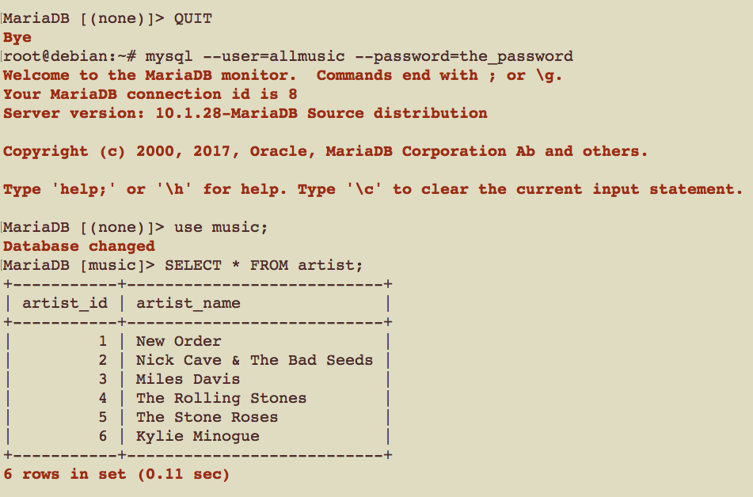

+ Let's try to use a different dataset or create a new database(We never granted the `allmusic` user the privilege to use other databases or create new databases)

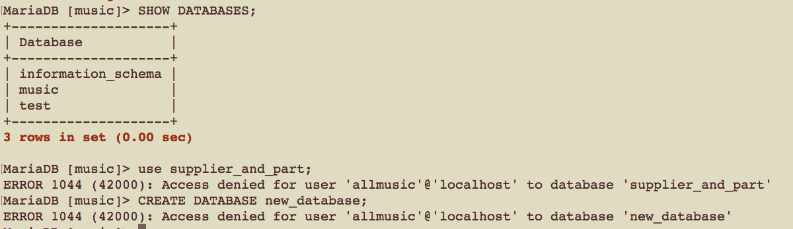

+ Let’s create a second new user who can access only the artist table in the music database (music.artist)

~~~~
GRANT ALL ON music.artist TO 'partmusic'@'localhost' IDENTIFIED BY 'the_password';
~~~~

+ Provide access to another table.

~~~~
-- Since we’re reusing the username and location 'partmusic'@'localhost', there’s no need to provide a password in this second statement
GRANT ALL ON music.album TO 'partmusic'@'localhost';
~~~~

+ You can also allow a user to access only specific columns in a table
  - instead of specifying `ALL` privileges, we’ve specified only `SELECT`
  - you can’t grant all privileges at the column level; you must specifically list them
~~~~
GRANT SELECT (track_id, time) ON music.track TO 'partmusic'@'localhost';
~~~~

+ Start the monitor as `partmusic` and let's take a look at the tables in music.

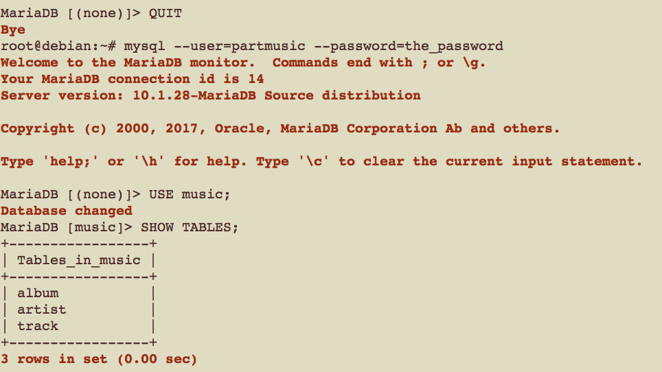

~~~~
-- 1. 
INSERT INTO artist VALUES (7, "The Jimi Hendrix Experience");
-- 2.
SELECT album_name FROM album WHERE album_id=4;
-- 3. no privileges to retrieve values from the columns other than track_id and time
SELECT * FROM track;
-- 4. 
SELECT time FROM TRACK LIMIT 3;
~~~~

+ Notice that, unlike databases and tables, you can see the details of all columns in a table even if you don’t have access to them.(This is the explanation in the textbook. In XAMPP, we can only see the descriptions of the two granted columns.)

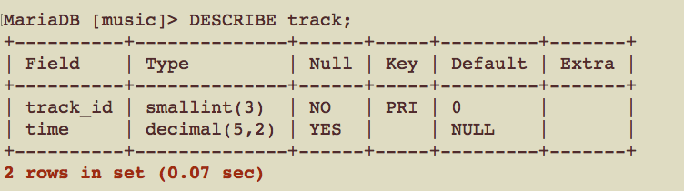

# 3. Privileges
+ [MySQL privileges](https://dev.mysql.com/doc/refman/8.0/en/privileges-provided.html)
  - We only discuss the privileges we have learned in this class
  ~~~~
  DELETE, INSERT, SELECT, SHOW DATABASES, UPDATE
  ALTER, CREATE, DROP, LOAD DATA INFILE, SELECT ... INTO 
  LOCK TABLES, UNLOCK TABLES
  ~~~~
  - For others, see the MySQL documentation.
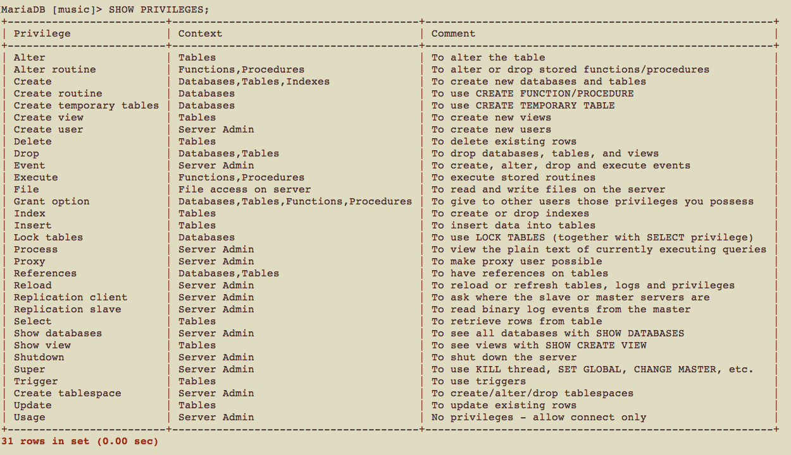

+ Privileges levels
  - Global level: `ON *.*`
  - Database level: `ON music.*`
  - Table level:  `ON music.album`
  - Column level: `SELECT (album_name, album_id) ON music.album`

+ Privileges and their levels in MySQL

|Privilege| Application|G|D|T|C|
|---|---|---|---|---|---|
|ALL|All simple privileges except the ability to grant privileges (GRANT OPTION)|✓|✓|✓|✗|
|ALTER|The ALTER TABLE statement|✓|✓|✓|✗|
|CREATE|The CREATE statement|✓|✓|✗|✗|
|DELETE|The DELETE statement|✓|✓|✓|✗|
|DROP|The DROP statement|✓|✓|✓|✗|
|EXECUTE|Stored procedures (MySQL version 5 and later only)|✓|✗|✗|✗|
|FILE|Reading and writing of disk files with SELECT ... INTO and LOAD DATA INFILE|✓|✗|✗|✗|
|GRANT OPTION|Ability to grant own privileges to others. For most applications, there is generally no need for this, because the root user decides on access privileges|✓|✓|✓|✗|
|INDEX|The CREATE INDEX and DROP INDEX statements|✓|✓|✓|✗|
|INSERT|The INSERT statement|✓|✓|✓|✓|
|LOCK TABLES|The use of LOCK TABLES and UNLOCK TABLES. Must have SELECT privilege for the tables. Since this is a database-wide privilege, it can only be granted using the database_name.* (or *.*) format|✓|✓|✗|✗|
|SELECT|The use of SELECT, allowing data to be read from the specified table(s)|✓|✓|✓|✓|
|SHOW DATABASES|Controls whether all databases are shown with SHOW DATABASES|✓|✗|✗|✗|
|UPDATE|The use of UPDATE to modify existing data in the specified table(s)|✓|✓|✓|✓|

# 4. The GRANT OPTION Privilege
+ The `GRANT OPTION` privilege allows a user to pass on any privileges she/he has to other users.

~~~~
-- connect to the monitor as the root user
mysql --user=root

-- we can not create a user without password using GRANT ALL ON music.* TO 'hugh'@'localhost', we need to use CREATE USER statement
-- 'hugh'@'localhost' has no privileges.
CREATE USER 'hugh'@'localhost'
-- grant privileges now
GRANT ALL ON music.* TO 'hugh'@'localhost';

-- allows him to pass on his privileges for the music database to other users
GRANT GRANT OPTION ON music.* TO 'hugh'@'localhost';

-- Quit the monitor, and then reconnect as the MySQL user hugh:
QUIT
mysql --user=hugh

-- let’s give our privileges to another user(but make sure user 'selina'@'localhost' exists or create it first)
GRANT ALL ON music.* TO 'selina'@'localhost';
-- pass on the GRANT OPTION privilege, so that selina can do the same things hugh can on the music database
GRANT GRANT OPTION ON music.* TO 'selina'@'localhost';

-- note: we can combine the two statements above as one(but make sure user 'lucy'@'localhost' exists or create it first)
GRANT ALL ON music.* to 'lucy'@'localhost' WITH GRANT OPTION;
~~~~

+ Users can pass on privileges at the same or lower levels

~~~~
-- Since hugh has all privileges for all tables in the music database, he can pass all privileges for only the artist table to a new user, rose, with no password
GRANT ALL ON music.artist TO 'rose'@'localhost';
~~~~
# 5. How Privileges Interact
+ MySQL privilege hierarchy

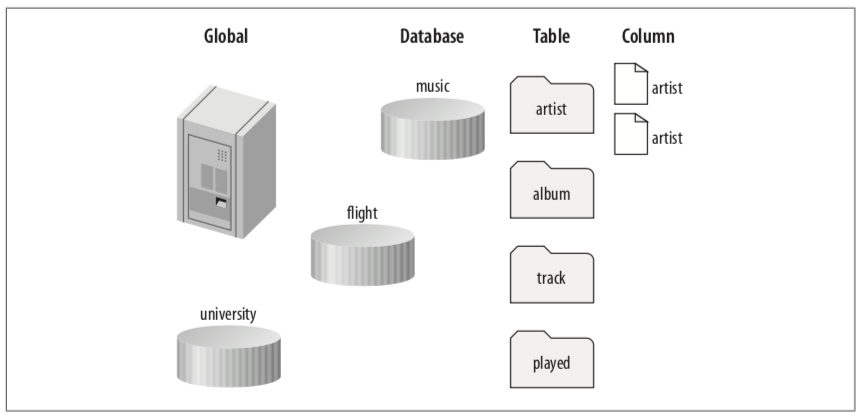

+ When you grant privileges at a level, those privileges are available at that and all lower levels.
+ When you run a statement, your privileges to run that statement are determined using a logical OR operation. The operation checks whether you have any of the following for the statement:
  - Global privileges
  - Database privileges
  - Table privileges
  - Column privileges
+ If any of these permit the statement, it proceeds. This has an important consequence: if you allow a privilege for a statement at a level, it doesn’t matter if it’s allowed or disallowed at another level.
# 6. Users and Hosts
+ basic principles of connecting to the server (how MySQL validates a connection?)

## 6.1 Local and Remote Users
+ A `local user` connects to the server and accesses the databases from the same computer that the MySQL server is running on (localhost).
  - If the client is local, the connection is made internally through a Unix socket (for Linux and Mac OS X) or through a named pipe (for Win- dows). 
  - This is generally much faster than the TCP/IP network connection used for remote access.
  
  
  
+ A `remote user` connects to the server and accesses the databases from another computer.
  
  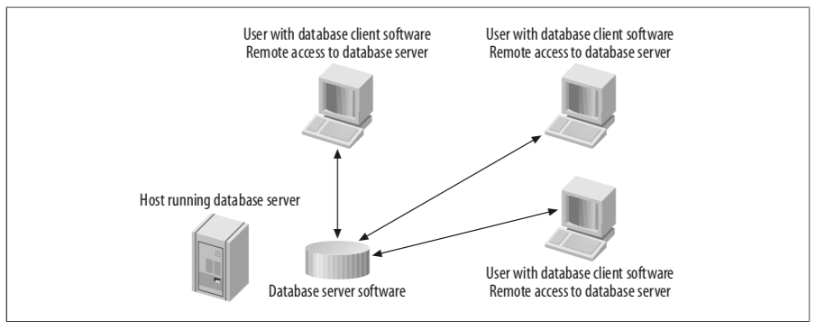
  
  - You should be careful not to give remote access to the database when you can avoid it.
  
  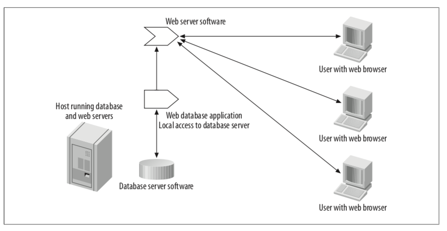
  
  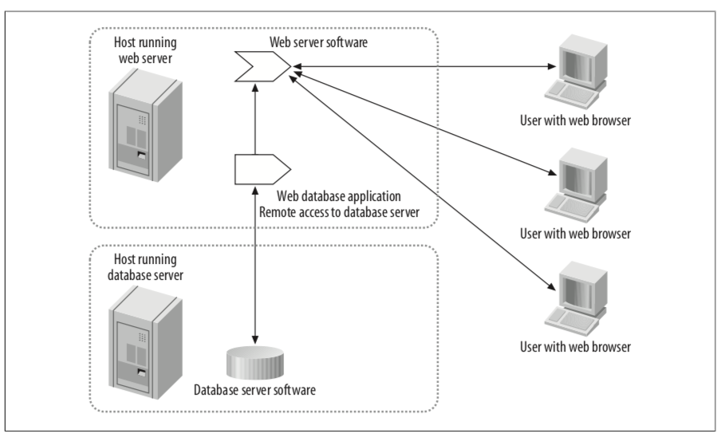
  
  
## 6.2 Creating a New Remote User
+ A home network with domain `invyhome.com`

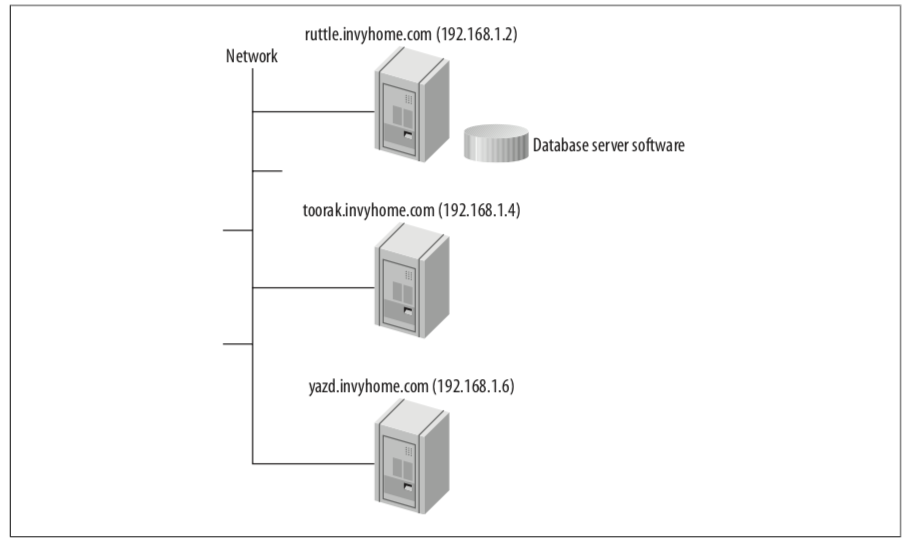

|IP|host name|
|---|---|
|192.168.1.2|ruttle.invyhome.com|
|192.168.1.4|toorak.invyhome.com|
|192.168.1.6|yazd.invyhome.com|

+ Let's first log into the MySQL server on `ruttle` as the `root` user and create a local user
~~~~
GRANT ALL on *.* TO 'hugh'@'localhost' IDENTIFIED BY 'the_password';
~~~~
+ Then, we can log in as `hugh`
  - Including the `--host=localhost` actually has no effect, since localhost is the default anyway.
~~~~
-- Don't forget to QUIT first
mysql --host=localhost --user=hugh --password=the_password
~~~~
+ We can also use `localhost`'s IP address `127.0.0.1`
~~~~
mysql --user=hugh --host=127.0.0.1 --password=the_password
~~~~
+ Now, let’s try connecting to the MySQL `server on ruttle` from `ruttle` by using its `IP address` or `name`
~~~~
-- will not work
mysql --user=hugh --host=192.168.1.2 --password=the_password
~~~~
~~~~
-- will not work
mysql --user=hugh --host=ruttle.invyhome.com --password=the_password
~~~~

+ If you want to allow access from 192.168.1.2 (and its equiv- alent domain name ruttle.invyhome.com), you need to grant those privileges by creating a new user with the username hugh and the host 192.168.1.2.
  - Note that each username and host pair is treated as a separate user and has its own password.
+ Log in to the monitor as the root user, and type:
~~~~
GRANT ALL ON *.* TO 'hugh'@'192.168.1.2' IDENTIFIED BY 'the_password';
~~~~
+ quit the monitor and try connecting as the user `hugh`:
~~~~
mysql --user=hugh --host=192.168.1.2 --password=the_password
~~~~

+ Suppose now that you want to allow toorak to access the MySQL server that’s running on ruttle. Do the following on `ruttle`
~~~~
GRANT ALL ON *.* TO 'hugh'@'toorak.invyhome.com' IDENTIFIED BY 'the_password';
~~~~
+ You’ll now find that you can run a MySQL monitor on toorak and connect to ruttle using the following command:
  - Using the IP addresses 192.168.1.2 for ruttle.invyhome.com and 192.168.1.4 for toorak.invyhome.com should work too, and it’s more secure, as IP addresses are harder to spoof than domain names.
~~~~
mysql --user=hugh --host=ruttle.invyhome.com --password=the_password
~~~~

+ Let’s consider other ways to allow the same user to connect from several locations. Suppose you want to allow jill to connect from any of the machines in the domain invyhome.com.
~~~~
GRANT ALL ON *.* TO 'jill'@'%.invyhome.com' IDENTIFIED BY 'the_password';
~~~~
or
~~~~
GRANT ALL ON *.* TO 'jill'@'192.168.1.%' IDENTIFIED BY 'the_password';
~~~~
+ **Host specification examples**

|Host specification |  Example |  Effect|
|----|----|----|
|Hostname|'lloyd'@'lloyd.lloydhouse.com'|1|
|Domain name|'lloyd'@'%.lloydhouse.com'|2|
|IP address|'lloyd'@'192.168.1.2'|3|
|IP address range|'lloyd'@'192.168.1.0/255.255.255.0'|4|
|Any machine|'lloyd'@'%' or 'lloyd'|5|
  
  - The effect of each of these settings is as follows:
    + (1). Connections are allowed only from the machine lloyd.lloydhouse.com.
    + (2). Connections are allowed from any machine in the lloydhouse.com domain.
    + (3). Connections are allowed only from the machine with the IP address 192.168.1.2.
    + (4). equivalen to '192.168.1.%'
    + (5). Connections are allowed from any machine
## 6.3 Anonymous Users
+ Wildcard characters aren’t allowed in usernames. e.g. `fred%'@'localhost`
+ We can have a user with an empty username that allows anonymous connections and matches all usernames.
  - example: create an anonymous local user who can read data from the music database.
    + Note that the username is specified as two single quotes, with nothing between them.
    + The MySQL server decides which user to log you in as based on a checklist we describe in the next section
  
  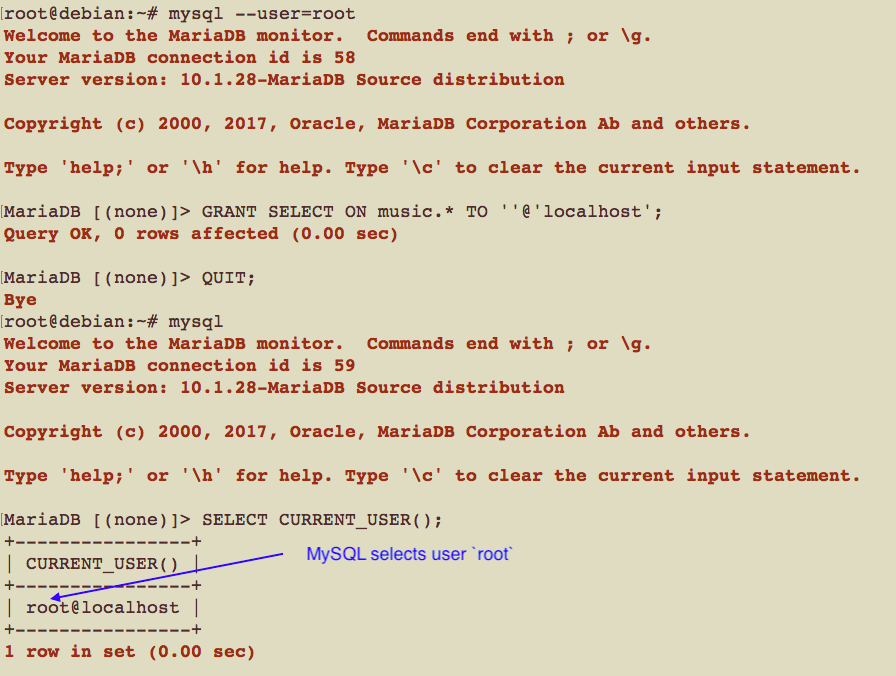
  

## 6.4 Which User Is Connected?
+ what happens if more than one user and host combination matches when a connection is attempted?
+ Example:
  - Let's create two users
  ~~~~
  -- The first user dave can now connect from any host and run only SELECT statements on the music database. '%' means all hosts
  GRANT SELECT ON music.* TO 'dave'@'%' IDENTIFIED BY 'the_password';
  -- The second user dave is specific to the localhost and is allowed all privileges on music.
  GRANT ALL ON music.* TO 'dave'@'localhost' IDENTIFIED BY 'the_password';
  ~~~~
  - Connect to server on `localhost`
  ~~~~
  mysql --user=dave --password=the_password
  ~~~~
  
  
  
  - the user is `dave` on `localhost`, who has priviledge `ALL`, let's double check it.
  ~~~~
  USE music;
  INSERT INTO artist VALUES (8, "The Psychedelic Furs");
  ~~~~
  
+ **How does MySQL decide which user to use when you establish a connection?**
  - 1. MySQL sorts the user entries by host from most to least specific and, for duplicate hosts, any anonymous user entry appears last.
  
  |most to least specific user by host|
  |----|
  |'dave'@'localhost'|
  |''@'localhost'|
  |'hugh'@'192.168.1.%'|
  |'dave'@'%'|
  
  
  - 2. The second step in establishing a connection is matching your connection request against the sorted list.
    + The first entry that matches your connection requirements is used.
    + If none match, you’re denied access.
  - connecting from the `local host` using the username `dave` matches `'dave'@'localhost'`
  - connecting from the `local host` using the username `hugh` matches `''@'localhost'`
  - connecting from the network machine `yazd (192.168.1.6)` as `dave` matches `'dave'@'%'`
## 7. Checking Privileges
### `SHOW GRANTS`
+ Checking the current user

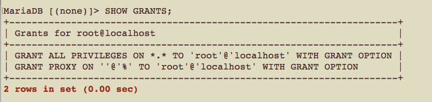

+ Checking the privileges of other users only if you have access to the `mysql` database
  - The first GRANT statement is a default privilege that creates the user with no privileges
  - The later statements add the privileges.
  
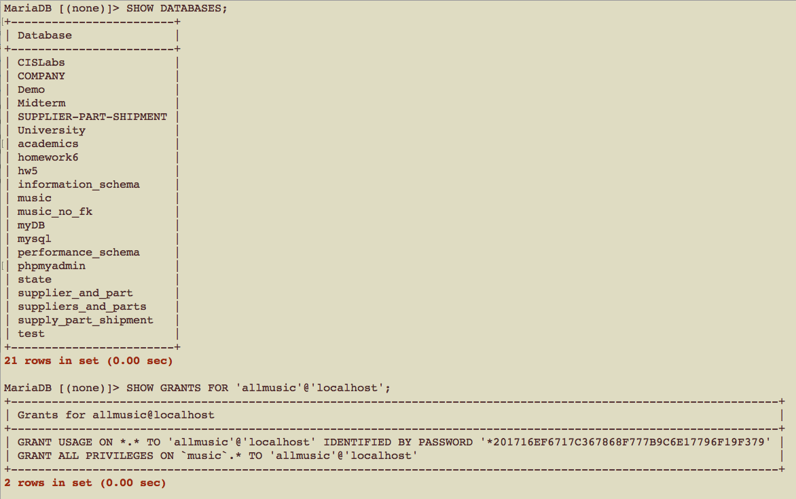

### `mysqlaccess`: see what level of access a particular user has for a particular database
+ Note:
  - 1. open the terminal from XAMPP, or do `QUIT` if you have logged in.
  - 2. use the correct password. If no password for user, you can ignore this argument
 
~~~~
-- Note: mysqlaccess may not work in xampp due to the settings of Perl
mysqlaccess --user=root --password=the_mysql_root_password partmusic music
~~~~

## 8. Revoking Privileges
+ Basic syntax
~~~~
-- log in as 'root'@'localhost'
REVOKE SELECT (time) ON music.track FROM 'partmusic'@'localhost';
~~~~
+ Removing privileges using the basic syntax is laborious
~~~~
REVOKE SELECT (track_id) ON music.track FROM 'partmusic'@'localhost';
REVOKE ALL PRIVILEGES ON music.artist FROM 'partmusic'@'localhost';
REVOKE ALL PRIVILEGES ON music.album FROM 'partmusic'@'localhost';
~~~~
+ remove all database-, table-, and column-level privileges of a user at once
~~~
REVOKE ALL PRIVILEGES FROM 'partmusic'@'localhost';
~~~
or
~~~~
REVOKE GRANT OPTION FROM 'partmusic'@'localhost';
~~~~
+ You can combine the two statements above as one
~~~~
REVOKE ALL PRIVILEGES, GRANT OPTION FROM 'partmusic'@'localhost';
~~~~

## 9. Removing Users
+ Removing privileges can not remove the user. This means the user can still connect, but has no privileges when she does. You can check this using the SHOW GRANTS statement:
~~~~
SHOW GRANTS FOR 'partmusic'@'localhost';
~~~~
+ `DROP USER` statement to remove the user
~~~~
DROP USER 'partmusic'@'localhost';
~~~~
+ Whenever you update the grant tables in the mysql database directly, you have to use the `FLUSH PRIVILEGES` instruction to tell the server to read in the updated data:
~~~~
FLUSH PRIVILEGES;
~~~~
## 10. Understanding and Changing Passwords
+ The simplest method to set a password is to use the IDENTIFIED BY clause when you create or modify the privileges of a user.
~~~
GRANT ALL ON music.* TO 'allmusic'@'localhost' IDENTIFIED BY 'the_password';
~~~
+ This process takes the plain-text string `the_password`, hashes it using the MySQL `PASSWORD( )` function, and stores the hashed string in the user table in the mysql data-base.

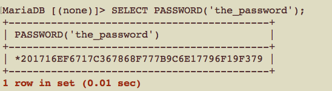

+ If the user exists, you can change the password while you’re granting new privileges, or simply by granting no further privileges as follows:
~~~~
-- create user selina with password the_password
GRANT ALL ON music.* TO 'selina'@'localhost' IDENTIFIED BY 'the_password';
-- change the password
GRANT USAGE ON *.* TO 'selina'@'localhost' IDENTIFIED BY 'another_password';
~~~~
+  `SET PASSWORD` statement
~~~~
SET PASSWORD FOR 'selina'@'localhost' = PASSWORD('another_password');
~~~~
+  You can set the password for the user you’re logged in as by using:
~~~~
SET PASSWORD=PASSWORD('the_password');
~~~~

+ In both cases, remember to include the `PASSWORD( )` function in the statement; if you leave it out, the server will store the plain-text password instead of the hashed string.

+ You can also use the mysqladmin password command to change your own password from the `command line`.
  - If the password contains spaces, enclose it in quotes.
~~~~
-- mysqladmin does not work either in XAMPP
mysqladmin --user=your_mysql_username --password=your_old_mysql_password password "your new mysql password"
~~~~
+ remove a user’s password
~~~~
SET PASSWORD FOR 'selina'@'localhost' = '';
~~~~
+ create a new user with the same password as another, but without knowing the plain text password. You can use `SHOW GRANT` or use `mysql database` to access to the hashed value.

~~~~
GRANT USAGE ON *.* TO 'partmusic'@'localhost' IDENTIFIED BY PASSWORD '*14E65567ABDB5135D0CFD9A70B3032C179A49EE7';
-- but you still need to use the plain text password to log in.
mysql --user=partmusic --password=the_password
~~~~
## 11. The Default Users
+ the user accounts that are created when MySQL is installed.(one or two default users)
  - `root`: This is the superuser, who can do anything to the server, users, databases, and data.
  - `anonymous`: 
    + This user has no username; you can use it to connect to the server without sup- plying any credentials.
    + It is used when host credentials match but the requested username doesn’t.
    + The anonymous user has very limited privileges by default.
### 11.1 Default User Configuration
#### Linux and Mac OS X
+ You can see the default configuration by listing the user- and hostnames in the user table of the mysql database:
~~~~
SELECT User,Host FROM mysql.user;
~~~~
+ You can use the `SHOW GRANT FOR 'user_name'@'host_name'` to check the defaut GRANT statement used to create it. e.g.:
~~~~
SHOW GRANTS for 'root'@'localhost';
~~~~
+ For the anonymous user
~~~~
SHOW GRANTS for ''@'localhost';
~~~~

+ Note: `We are using XAMPP, So a linux platfrom`.
#### Windows
+ only `root` user by default
~~~~
SELECT User,Host FROM mysql.user;

SHOW GRANTS for 'root'@'localhost';
~~~~
### 11.2 Securing the Default Users
take steps to secure the users
+ Always set a password for the root user
+ Remove privileges for the test databases
  - Allowing any user to work with the test database and any database beginning with the string test_ is insecure.
+ Remove anonymous access
  - Unless you want anyone to be able to connect to your MySQL server, it’s better to allow access only by named users.
+ Remove remote access
  - Unless there’s a requirement for the server to allow client connections from other machines, it’s better to allow access from only the localhost. If you need remote access, read “Devising a User Security Policy” to devise an appropriate access policy.
~~~~
-- log in to the monitor as the root user
mysql --user=root --password=the_mysql_root_password

-- set a password for the root user connecting from localhost
SET PASSWORD FOR 'root'@'localhost' = password('the_mysql_root_password');

-- remove access to the test databases
REVOKE ALL ON test.* FROM ''@'%';
REVOKE ALL ON `test\_%`.* FROM ''@'%';

-- never need to remove test database
-- DROP DATABASE test;

-- remove anonymous access
DROP USER ''@'localhost';
DROP USER ''@'host.domain; -- use this statement if @'host.domain exists

-- Alternatively, you can manually update the grant tables
DELETE FROM mysql.user WHERE User = '';
FLUSH PRIVILEGES;

-- Instead of deleting the anonymous accounts, you can disable unauthenticated access to the server by setting passwords for these accounts:
-- better to remove any anonymous users instead of setting passwords
UPDATE mysql.user SET Password = PASSWORD('the_new_anonymous_user_password')
WHERE User = '';
FLUSH PRIVILEGES;

-- Since we’ve removed the anonymous user, the only remaining user is root; we can remove remote access for root with
-- replace host.domain with the true host name
DROP USER 'root'@'host.domain'

-- Again, you can instead manually modify the grant tables; here, you can delete all accounts that have a host other then localhost
DELETE FROM mysql.user WHERE Host <> 'localhost';
FLUSH PRIVILEGES;
~~~~

+ Note: **you can even remove the root account!**, so do not use the DELETE statement if we have some alternative.
## 12. Devising a User Security Policy
+ develop a security policy and a maintainable, flexible, secure MySQL installation.
+  how to balance server performance against security.
  - Flexibility and security are enemies. 
+  develop the thinking that’ll allow you to effectively manage your MySQL server.
## 12.1 Choosing Users and Privileges
+ `default allow` vs. `default deny` philosophy
  - In the “default allow” philosophy, you decide on all of the users you might need and grant them all privileges. You then explicitly revoke any privileges they don’t need.
  - In the “default deny” philosophy, you decide on the users you must have and create them with no privileges. You then explicitly grant the privileges that these users need. 
  - Security experts prefer the “default deny” approach over the “default allow” one, since there’s a smaller chance that you’ll create users or privileges that make your server insecure. 
  - Developers tend to prefer the “default allow” approach, since you only need to think about the few things that you don’t want to happen, rather than the larger set of things you do want to allow. 
  - We recommend that you use the “default deny” approach during production, but the “default allow” approach is acceptable if you’re just experimenting on noncritical data in a relatively secure environment.

+ “default deny” philosophy:
  - Clients: From what computers does the database server need to be accessed?
  - Users: Who needs access to the database server? 
  - Privileges: What needs to be done?
## 12.2 More Security Tips
Think very carefully before granting these privileges:
+ `ALTER`: The ALTER privilege allows the user to change the structure of databases
+ `FILE`: The FILE privilege allows the user to use statements that read and write disk files
+ `CREATE`, `DROP`, and `INDEX`: The INDEX privilege is a subset of CREATE, allowing only the key-creation feature
+ `GRANT OPTION`: This privilege allows one user to pass on privileges to another.
+ `PROCESS`: This allows the user to view current processes, including the statements that started them.
+ `SHUTDOWN`: This allows a user to stop the server.

Tips:

+ You should avoid granting any privileges on the special `mysql` database. This is a default part of any MySQL installation that stores user privileges. Nobody other than the MySQL root user should be able to be read, change, or delete information in this database.
+ Avoid granting access to `anonymous users`. You should instead require that all users be explicitly identified, along with the hosts they can connect from and the databases that they can access.
+ Choose good passwords: always specify passwords when creating users, and ensure these passwords meet the basic criteria of being hard to guess while remaining straight- forward to remember.
+ Finally, use secure remote connections: if you allow remote access to the MySQL server, require that these connections be encrypted. We don’t discuss how to do this, but you’ll find more detail under the heading “Using Secure Connections” in the MySQL manual.
## 12.3 Resource-Limit Controls
+ The number of SQL statements per hour, using the `MAX_QUERIES_PER_HOUR` clause. All statements executed by a user are counted toward this limit.
+ The number of updates per hour, using the `MAX_UPDATES_PER_HOUR` clause. Any statement that modifies a database or its tables counts toward this limit.
+ The number of connections per hour, using the `MAX_CONNECTIONS_PER_HOUR` clause. Any connection, from the monitor, a program, or a web script, counts toward this limit.

~~~~
-- Since we use USAGE, the privileges aren’t affected when the new limits are imposed.
GRANT USAGE ON *.* to 'partmusic'@'localhost' WITH
MAX_QUERIES_PER_HOUR 100
MAX_UPDATES_PER_HOUR 10
MAX_CONNECTIONS_PER_HOUR 5;
~~~~

+ Another useful parameter to manage the MySQL server load is the `MAX_USER_CONNECTIONS` option. This limits the number of simultaneous clients that can access the server.

## 12.4 The mysql_setpermission Program
+ mysql_setpermission is an interactive program that allows you to choose from a menu of routine database and user administration tasks, such as creating a database, setting a user password, and modifying user privileges. 
~~~
-- It doesn't work if there is some Perl setting problem
mysql_setpermission --user=root --password=the_mysql_root_password
~~~
## 13. Managing Privileges with SQL
+ MySQL privileges are managed in five tables(`user, db, tables_priv, col umns_priv, and host.`) in the mysql database. You can manage this database yourself, using queries to manage users and privileges rather than using the GRANT and REVOKE statements. 
## 13.1 The user Table
+ Each row has around 30 columns
  - `User`, `Password`, and `Host` contains the credentials
  -  Each row also contains a Y or N for each possible privilege.
## 13.2 The db Table
+ When you grant privileges for a particular database, they are stored in the db table of the mysql database.
+ The table is similar to the user table but stores privilege values for Host, Db, and User combinations.
## 13.3 The tables_priv Table
+ The tables_priv table stores privileges for the table level. 
+ This is similar to the db table but holds privilege values for Host, Db, User, and Table_name combinations.
## 13.4 The columns_priv Table
+ The columns_priv table lists which privileges are available for which columns. 
+ It’s only accessed if the tables_priv table says that a privilege is available for one or more col- umns in a table and that privilege isn’t already available at the table level. 
## 13.5 The host Table
+ This table isn’t modified or accessed by the GRANT and REVOKE statements. Therefore, it can be maintained only by SQL queries, and so remains unused in most MySQL installations.
## 13.6 Activating Privileges
+ Whenever we manipulate the mysql database with SQL statements, we run the `FLUSH PRIVILEGES` statement afterward.
+ You must remember to run FLUSH PRIVILEGES after any privilege or user modifications are per- formed with SQL statements; you don’t need to use FLUSH PRIVILEGES with GRANT or REVOKE, as the server does this for you automatically.

~~~~
INSERT INTO host VALUES ('localhost', 'music', 'Y','Y','Y','Y','Y','Y','Y','Y','Y','Y','Y','Y');
FLUSH PRIVILEGES;
~~~~
## 14. Privileges and Performance
+ when you implement complex user and privilege settings, checking these for each SQL statement you execute adds a performance penalty.
+ When you choose your users and their privileges, you should strive to balance control and performance. Here are some basic tips:
  - Keep it simple. 
  - Grant the privilege as high up the hierarchy as possible.
  - Minimize your use of the host table.
## 15. Resetting Forgotten MySQL Passwords
+ If you’ve forgotten a MySQL user password, you can log in to the server as the MySQL root user and update the password manually.
+ If you’ve forgotten the root password, you’ll need to stop the server and restart it in a special way to allow you to change the root password(see details in the textbook).
