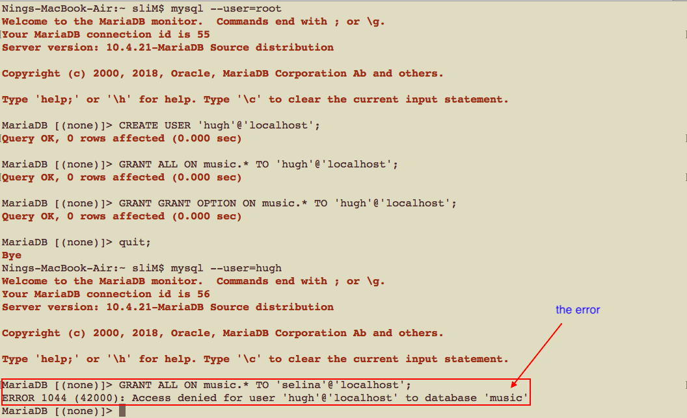
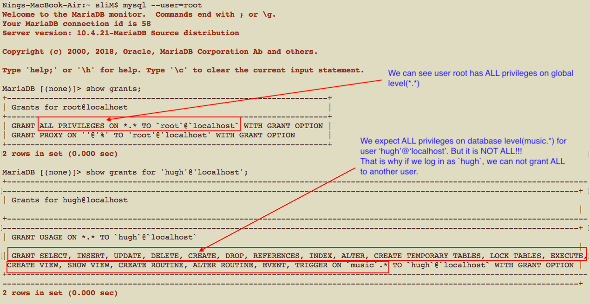
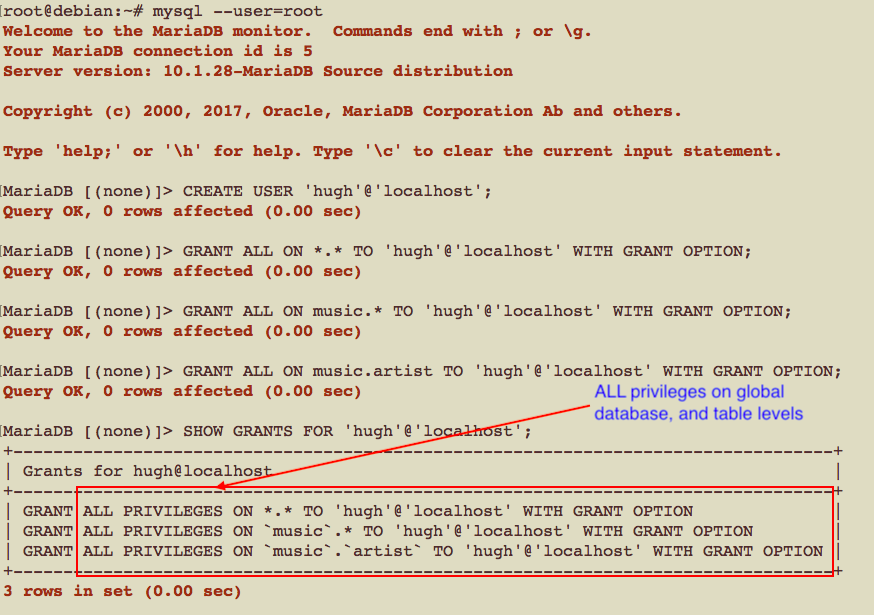

# The `Grant Option` problem

+ In today's class (Tuesday 04/26/2022), we had some problem when we tried to run the following commands to deal with `Grant Option`.
  - Note that the error happens only when using `XAMPP 8 on Mac`.
  - If you are using `Windows` or `XAMPP 7 on Mac`, everything goes well.
~~~~
-- connect to the monitor as the root user
mysql --user=root

-- we can not create a user without password using GRANT ALL ON music.* TO 'hugh'@'localhost', we need to use CREATE USER statement
-- 'hugh'@'localhost' has no privileges.
CREATE USER 'hugh'@'localhost';

-- create another user for later use(hugh will grant privileges to selina)
-- If you already have these two users in your database, no need to create them
CREATE USER 'selina'@'localhost';

-- grant privileges now
GRANT ALL ON music.* TO 'hugh'@'localhost';

-- allows him to pass on his privileges for the music database to other users
GRANT GRANT OPTION ON music.* TO 'hugh'@'localhost';

-- Quit the monitor, and then reconnect as the MySQL user hugh:
quit;
mysql --user=hugh

-- let’s give our privileges to another user(but make sure user 'selina'@'localhost' exists or create it first)
GRANT ALL ON music.* TO 'selina'@'localhost';
-- pass on the GRANT OPTION privilege, so that selina can do the same things hugh can on the music database
GRANT GRANT OPTION ON music.* TO 'selina'@'localhost';
~~~~
+ We had an error when executing command `GRANT ALL ON music.* TO 'selina'@'localhost';`

+ The reason is user `'hugh'@'localhost'` did not get the `ALL` privilege at database level `music.*.

+ But if the `root` user `GRANT ALL` a different level. It works.

+ I also tried those command on `Windows` and `XAMPP 7 on Mac`, no problem at all.
  - XAMPP 7 on Mac

  
  
  - I will upload the results for Windows later.

+ I am still working on this issue.

+ If you are using `XAMPP 8 on Mac`, could you please run those commands to see if you can get the same results?
