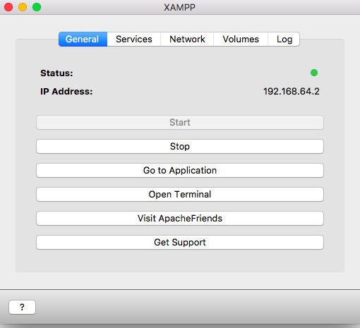
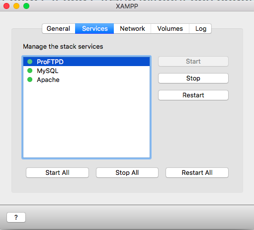
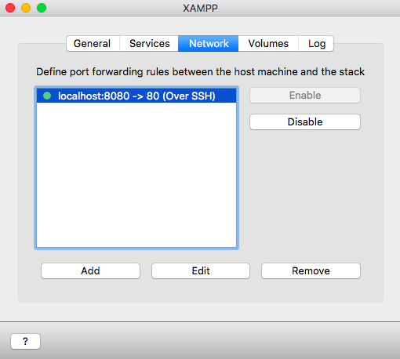

# XAMPP Installation
+ Go to the [XAMPP website](https://www.apachefriends.org/index.html) to download and install it according to the operating system of your computer.

# Start MySQL Server
## MAC
+ In **General**, click **Start**

+ In **Services**, choose each service and **Start**.(At least MySQL and Apache)

+ In **Network**, **Enable** localhost:8080

+ In the web browser, type "localhost:8080" then click phpMyAdmin on the top-right corner

## Windows
+ Start the **Apache** and **MySQL** services.

+ Click **Admin** for MySQL or type **localhost** in the web brower and click phpMyAdmin
