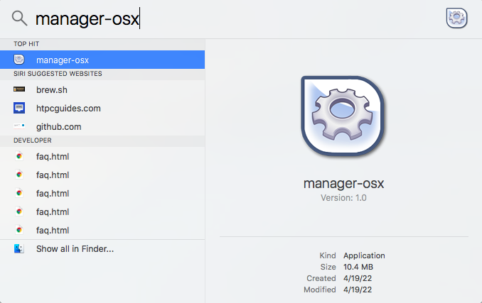
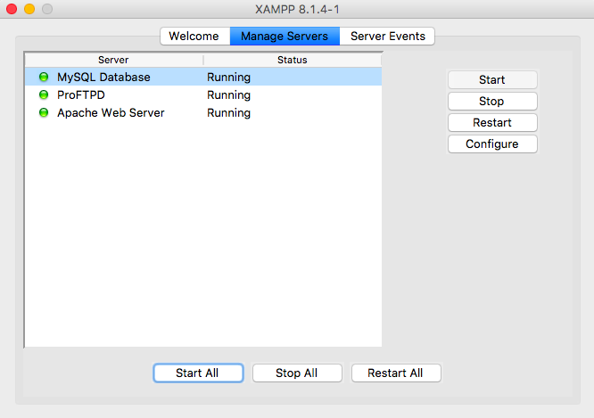

# XAMPP 8.1.4 Installation
+ Go to the [XAMPP website](https://www.apachefriends.org/index.html) to download and install it according to the operating system of your computer.
  - Note: For Mac, if the filename extension is bz2 instead of dmg, change it to dmg before the installation.
# Launch XAMPP Application
## MAC

+ Search for `manager-osx` in `Spotlight Search`

## Windows

+ Double-click `xampp-control` in `C:\xampp`

# Start MySQL Server

## MAC

+ In **Manage Servers**, choose each service and **Start**.(At least MySQL and Apache)

+ In the web browser, type `localhost` then click `phpMyAdmin` on the top-right corner

## Windows
+ Start the **Apache** and **MySQL** services.

+ Click **Admin** for MySQL or type **localhost** in the web brower and click phpMyAdmin
